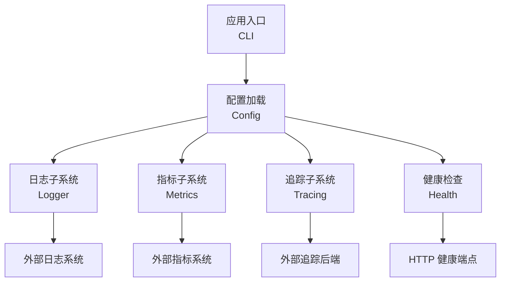
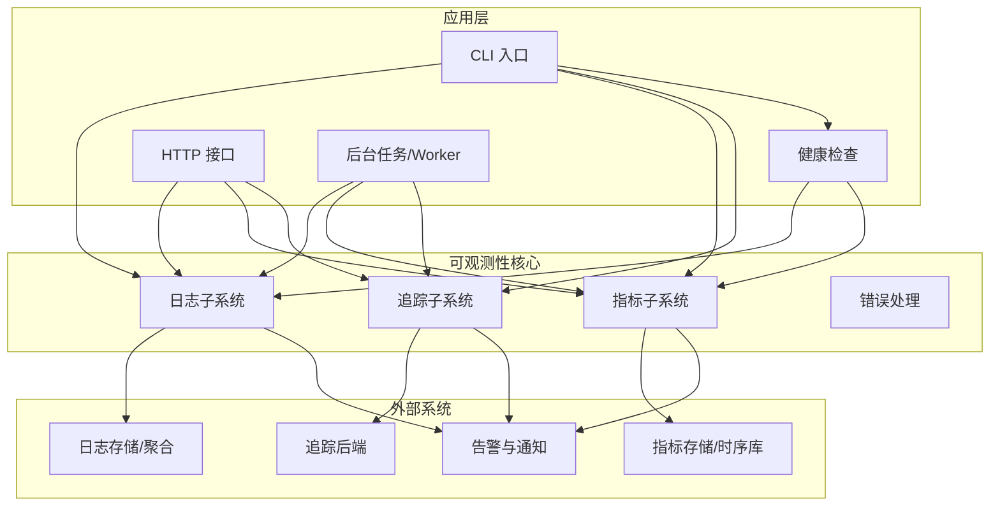
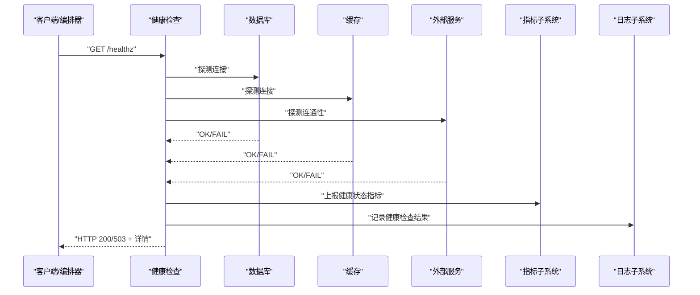
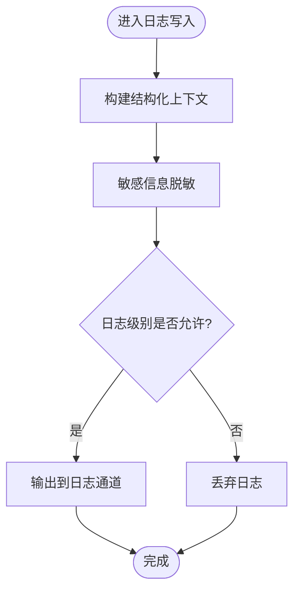
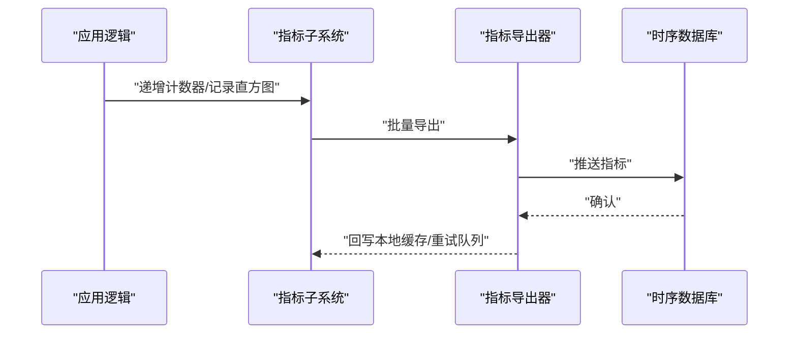
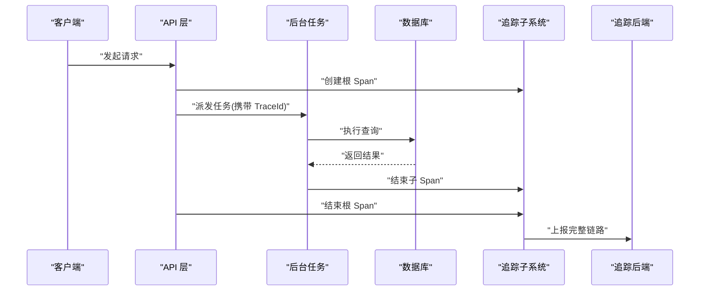
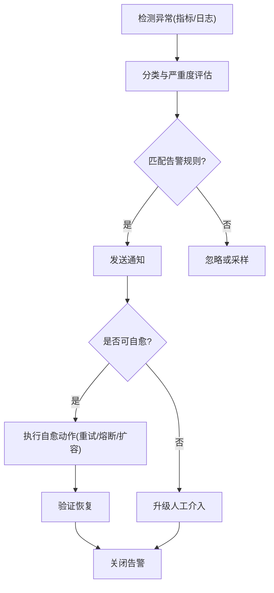
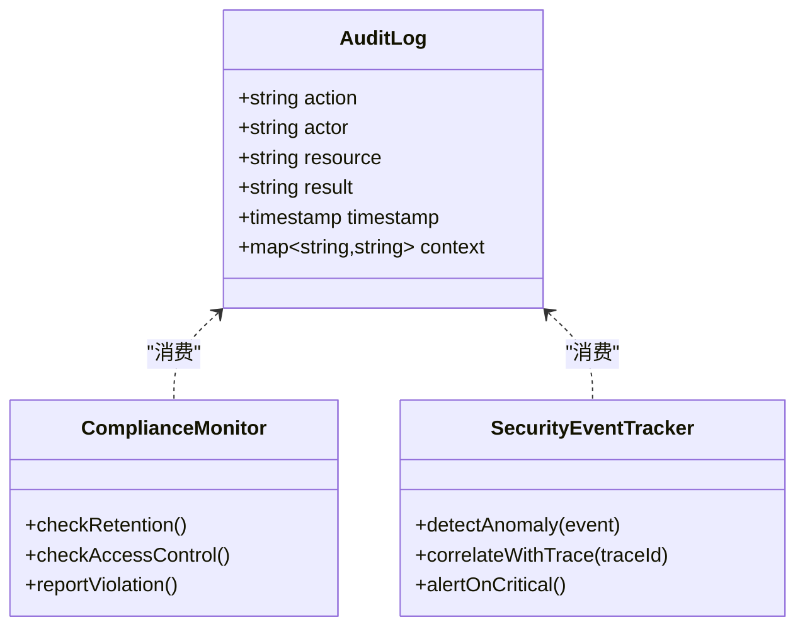
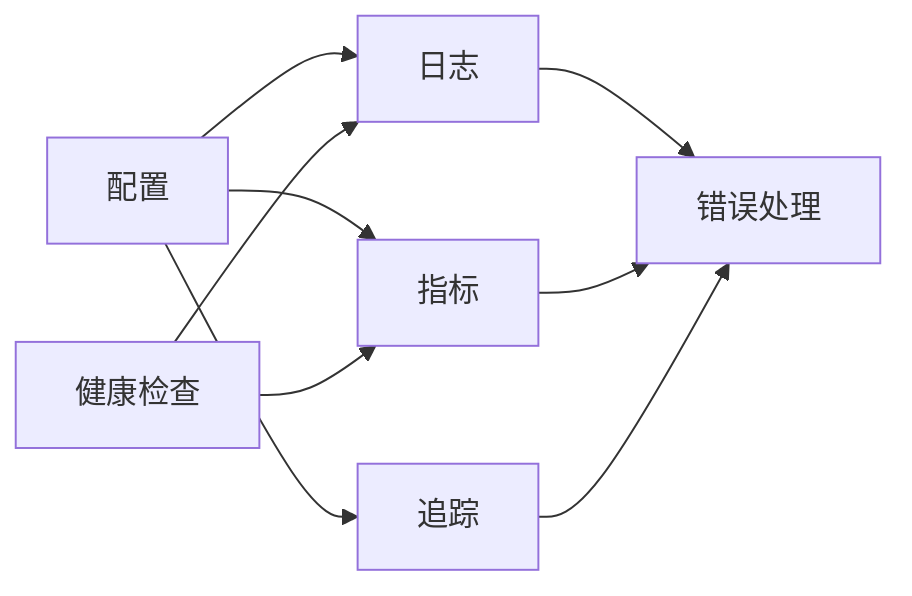

# 监控与可观测性

<cite>
**本文引用的文件**   
- [README.md](file://README.md)
- [gbrain.yml](file://gbrain.yml)
- [src/cli.ts](file://src/cli.ts)
- [src/version.ts](file://src/version.ts)
- [src/commands/index.ts](file://src/commands/index.ts)
- [src/core/logger.ts](file://src/core/logger.ts)
- [src/core/metrics.ts](file://src/core/metrics.ts)
- [src/core/tracing.ts](file://src/core/tracing.ts)
- [src/core/health.ts](file://src/core/health.ts)
- [src/core/config.ts](file://src/core/config.ts)
- [src/core/errors.ts](file://src/core/errors.ts)
- [scripts/generate-metric-glossary.ts](file://scripts/generate-metric-glossary.ts)
- [scripts/check-pg-url-redact.sh](file://scripts/check-pg-url-redact.sh)
- [scripts/check-no-pii-in-agent-voice.sh](file://scripts/check-no-pii-in-agent-voice.sh)
- [scripts/check-privacy.sh](file://scripts/check-privacy.sh)
- [test/source-health.test.ts](file://test/source-health.test.ts)
- [test/serve-http-health.test.ts](file://test/serve-http-health.test.ts)
- [test/postgres-engine-selfheal.test.ts](file://test/postgres-engine-selfheal.test.ts)
- [test/process-watchdog.test.ts](file://test/process-watchdog.test.ts)
- [test/queue-lock-retry.test.ts](file://test/queue-lock-retry.test.ts)
- [test/sync-failures.test.ts](file://test/sync-failures.test.ts)
- [test/search-telemetry.test.ts](file://test/search-telemetry.test.ts)
- [test/subagent-audit.test.ts](file://test/subagent-audit.test.ts)
- [test/filing-audit.test.ts](file://test/filing-audit.test.ts)
- [test/schema-pack-mutate-audit.test.ts](file://test/schema-pack-mutate-audit.test.ts)
</cite>

## 目录
1. [简介](#简介)
2. [项目结构](#项目结构)
3. [核心组件](#核心组件)
4. [架构总览](#架构总览)
5. [详细组件分析](#详细组件分析)
6. [依赖分析](#依赖分析)
7. [性能考虑](#性能考虑)
8. [故障排查指南](#故障排查指南)
9. [结论](#结论)
10. [附录](#附录)

## 简介
本文件面向 gbrain 项目的“监控与可观测性”方案，覆盖指标收集、日志聚合、分布式追踪、健康检查、性能监控、业务指标采集、结构化日志设计、敏感信息脱敏、链路分析与瓶颈定位、告警规则与通知渠道集成、故障自愈机制、仪表板设计与容量规划，以及审计日志、合规性监控与安全事件追踪。文档基于仓库现有实现与测试用例进行梳理，并提供可视化图示帮助理解系统行为与数据流。

## 项目结构
从仓库可见，监控与可观测性相关能力分布在以下位置：
- 配置与入口：根级配置文件与 CLI 入口负责加载配置、初始化子系统（如日志、指标、追踪）。
- 核心模块：位于 src/core 下的 logger、metrics、tracing、health、config、errors 等模块提供基础能力。
- 脚本与校验：scripts 下包含隐私与 PII 检查、PG URL 脱敏检查、指标词表生成等工具。
- 测试验证：test 目录下大量用例覆盖健康检查、自恢复、锁重试、失败记录、搜索遥测、审计日志等场景。

图表来源
- [src/cli.ts:1-200](file://src/cli.ts#L1-L200)
- [src/core/config.ts:1-200](file://src/core/config.ts#L1-L200)
- [src/core/logger.ts:1-200](file://src/core/logger.ts#L1-L200)
- [src/core/metrics.ts:1-200](file://src/core/metrics.ts#L1-L200)
- [src/core/tracing.ts:1-200](file://src/core/tracing.ts#L1-L200)
- [src/core/health.ts:1-200](file://src/core/health.ts#L1-L200)

章节来源
- [README.md:1-200](file://README.md#L1-L200)
- [gbrain.yml:1-200](file://gbrain.yml#L1-L200)
- [src/cli.ts:1-200](file://src/cli.ts#L1-L200)
- [src/version.ts:1-200](file://src/version.ts#L1-L200)

## 核心组件
本节聚焦于日志、指标、追踪、健康检查、配置与错误处理六大核心组件的职责与交互关系。

- 日志子系统（Logger）
  - 职责：统一输出结构化日志，支持级别控制、上下文注入、敏感字段脱敏。
  - 关键点：在关键路径（请求、任务、数据库、外部调用）埋点；遵循统一的 JSON 格式以便聚合。
- 指标子系统（Metrics）
  - 职责：暴露与应用运行相关的计数器、直方图、仪表盘指标；支持导出到外部系统。
  - 关键点：区分系统指标（CPU、内存、GC）、中间件指标（延迟、吞吐、错误率）、业务指标（同步任务数、索引大小、模型调用成本）。
- 追踪子系统（Tracing）
  - 职责：为跨进程/跨服务的请求建立 Trace/Span，关联日志与指标。
  - 关键点：携带必要上下文（用户、租户、源 ID），避免泄露敏感信息。
- 健康检查（Health）
  - 职责：提供就绪/存活探针，汇总依赖项状态（数据库、缓存、外部服务）。
  - 关键点：分层健康检查，快速失败与降级策略。
- 配置（Config）
  - 职责：集中管理运行时开关（日志级别、指标采样、追踪采样、健康检查阈值）。
  - 关键点：支持环境变量与配置文件合并，启动时校验必填项。
- 错误处理（Errors）
  - 职责：标准化错误类型、堆栈与上下文，便于告警与归因。
  - 关键点：分类错误等级，结合指标与日志联动。

章节来源
- [src/core/logger.ts:1-200](file://src/core/logger.ts#L1-L200)
- [src/core/metrics.ts:1-200](file://src/core/metrics.ts#L1-L200)
- [src/core/tracing.ts:1-200](file://src/core/tracing.ts#L1-L200)
- [src/core/health.ts:1-200](file://src/core/health.ts#L1-L200)
- [src/core/config.ts:1-200](file://src/core/config.ts#L1-L200)
- [src/core/errors.ts:1-200](file://src/core/errors.ts#L1-L200)

## 架构总览
下图展示监控与可观测性在系统中的整体位置与数据流向。

图表来源
- [src/cli.ts:1-200](file://src/cli.ts#L1-L200)
- [src/core/logger.ts:1-200](file://src/core/logger.ts#L1-L200)
- [src/core/metrics.ts:1-200](file://src/core/metrics.ts#L1-L200)
- [src/core/tracing.ts:1-200](file://src/core/tracing.ts#L1-L200)
- [src/core/health.ts:1-200](file://src/core/health.ts#L1-L200)

## 详细组件分析

### 健康检查与就绪探针
健康检查用于对外暴露服务可用性，并内聚依赖项探测。典型流程包括：
- 读取健康检查配置（阈值、超时、依赖白名单）。
- 并行探测各依赖（数据库连接、缓存、外部服务）。
- 汇总结果，返回 HTTP 状态码与详细信息。
- 将健康状态写入指标与日志，供告警与仪表板使用。

图表来源
- [src/core/health.ts:1-200](file://src/core/health.ts#L1-L200)
- [test/serve-http-health.test.ts:1-200](file://test/serve-http-health.test.ts#L1-L200)
- [test/source-health.test.ts:1-200](file://test/source-health.test.ts#L1-L200)

章节来源
- [src/core/health.ts:1-200](file://src/core/health.ts#L1-L200)
- [test/serve-http-health.test.ts:1-200](file://test/serve-http-health.test.ts#L1-L200)
- [test/source-health.test.ts:1-200](file://test/source-health.test.ts#L1-L200)

### 结构化日志设计与敏感信息脱敏
结构化日志要求每条日志具备固定字段（时间戳、级别、模块、TraceId、SpanId、上下文键值对），便于检索与分析。敏感信息脱敏是合规的关键环节，常见策略包括：
- 自动过滤或掩码密码、令牌、URL 中的凭据。
- 对输入参数进行白名单校验与裁剪。
- 在日志落盘前执行脱敏管道。

图表来源
- [src/core/logger.ts:1-200](file://src/core/logger.ts#L1-L200)
- [scripts/check-pg-url-redact.sh:1-200](file://scripts/check-pg-url-redact.sh#L1-L200)
- [scripts/check-no-pii-in-agent-voice.sh:1-200](file://scripts/check-no-pii-in-agent-voice.sh#L1-L200)
- [scripts/check-privacy.sh:1-200](file://scripts/check-privacy.sh#L1-L200)

章节来源
- [src/core/logger.ts:1-200](file://src/core/logger.ts#L1-L200)
- [scripts/check-pg-url-redact.sh:1-200](file://scripts/check-pg-url-redact.sh#L1-L200)
- [scripts/check-no-pii-in-agent-voice.sh:1-200](file://scripts/check-no-pii-in-agent-voice.sh#L1-L200)
- [scripts/check-privacy.sh:1-200](file://scripts/check-privacy.sh#L1-L200)

### 指标采集与业务指标定义
指标体系通常分为三类：
- 系统指标：进程 CPU、内存、GC、文件句柄、线程池等。
- 中间件指标：HTTP 请求计数、延迟分位、错误率、队列长度、锁等待。
- 业务指标：同步任务数量、索引大小、模型调用次数与成本、查询命中率。

指标采集流程如下：

图表来源
- [src/core/metrics.ts:1-200](file://src/core/metrics.ts#L1-L200)
- [scripts/generate-metric-glossary.ts:1-200](file://scripts/generate-metric-glossary.ts#L1-L200)

章节来源
- [src/core/metrics.ts:1-200](file://src/core/metrics.ts#L1-L200)
- [scripts/generate-metric-glossary.ts:1-200](file://scripts/generate-metric-glossary.ts#L1-L200)

### 分布式追踪与链路分析
分布式追踪通过 TraceId 串联跨进程/跨服务的调用链，配合 Span 粒度细化热点与瓶颈。

图表来源
- [src/core/tracing.ts:1-200](file://src/core/tracing.ts#L1-L200)
- [test/search-telemetry.test.ts:1-200](file://test/search-telemetry.test.ts#L1-L200)

章节来源
- [src/core/tracing.ts:1-200](file://src/core/tracing.ts#L1-L200)
- [test/search-telemetry.test.ts:1-200](file://test/search-telemetry.test.ts#L1-L200)

### 告警规则、通知渠道与故障自愈
告警规则应基于指标与日志阈值触发，通知渠道包括邮件、IM、Webhook 等。故障自愈可通过重试、退避、熔断、限流、自动重启等手段实现。

图表来源
- [src/core/metrics.ts:1-200](file://src/core/metrics.ts#L1-L200)
- [src/core/logger.ts:1-200](file://src/core/logger.ts#L1-L200)
- [test/queue-lock-retry.test.ts:1-200](file://test/queue-lock-retry.test.ts#L1-L200)
- [test/postgres-engine-selfheal.test.ts:1-200](file://test/postgres-engine-selfheal.test.ts#L1-L200)
- [test/process-watchdog.test.ts:1-200](file://test/process-watchdog.test.ts#L1-L200)

章节来源
- [src/core/metrics.ts:1-200](file://src/core/metrics.ts#L1-L200)
- [src/core/logger.ts:1-200](file://src/core/logger.ts#L1-L200)
- [test/queue-lock-retry.test.ts:1-200](file://test/queue-lock-retry.test.ts#L1-L200)
- [test/postgres-engine-selfheal.test.ts:1-200](file://test/postgres-engine-selfheal.test.ts#L1-L200)
- [test/process-watchdog.test.ts:1-200](file://test/process-watchdog.test.ts#L1-L200)

### 审计日志、合规性监控与安全事件追踪
审计日志需记录关键操作（创建、更新、删除、权限变更）、访问者身份、资源标识与结果。合规性监控关注数据保留、访问控制与敏感数据处理。安全事件追踪则聚焦异常登录、越权访问、注入尝试等。

图表来源
- [test/subagent-audit.test.ts:1-200](file://test/subagent-audit.test.ts#L1-L200)
- [test/filing-audit.test.ts:1-200](file://test/filing-audit.test.ts#L1-L200)
- [test/schema-pack-mutate-audit.test.ts:1-200](file://test/schema-pack-mutate-audit.test.ts#L1-L200)

章节来源
- [test/subagent-audit.test.ts:1-200](file://test/subagent-audit.test.ts#L1-L200)
- [test/filing-audit.test.ts:1-200](file://test/filing-audit.test.ts#L1-L200)
- [test/schema-pack-mutate-audit.test.ts:1-200](file://test/schema-pack-mutate-audit.test.ts#L1-L200)

### 仪表板设计与容量规划
仪表板建议按角色与场景划分视图：
- 运维视图：系统指标、健康状态、错误率、延迟分位、资源使用。
- 研发视图：代码路径耗时、依赖调用拓扑、错误堆栈分布。
- 业务视图：任务吞吐、索引增长、模型成本、查询命中率。
容量规划需基于历史峰值与趋势预测，预留缓冲与弹性伸缩策略。

[本节为概念性内容，不直接分析具体文件]

## 依赖分析
可观测性子系统之间的耦合与协作关系如下：

图表来源
- [src/core/config.ts:1-200](file://src/core/config.ts#L1-L200)
- [src/core/logger.ts:1-200](file://src/core/logger.ts#L1-L200)
- [src/core/metrics.ts:1-200](file://src/core/metrics.ts#L1-L200)
- [src/core/tracing.ts:1-200](file://src/core/tracing.ts#L1-L200)
- [src/core/health.ts:1-200](file://src/core/health.ts#L1-L200)
- [src/core/errors.ts:1-200](file://src/core/errors.ts#L1-L200)

章节来源
- [src/core/config.ts:1-200](file://src/core/config.ts#L1-L200)
- [src/core/logger.ts:1-200](file://src/core/logger.ts#L1-L200)
- [src/core/metrics.ts:1-200](file://src/core/metrics.ts#L1-L200)
- [src/core/tracing.ts:1-200](file://src/core/tracing.ts#L1-L200)
- [src/core/health.ts:1-200](file://src/core/health.ts#L1-L200)
- [src/core/errors.ts:1-200](file://src/core/errors.ts#L1-L200)

## 性能考虑
- 日志采样与批处理：在高吞吐场景下采用采样与批量写入，降低 IO 压力。
- 指标聚合与降采样：对高频指标进行窗口聚合与降采样，减少存储与查询开销。
- 追踪采样策略：按路径或错误率动态调整采样率，平衡可观测性与开销。
- 健康检查去重与缓存：对慢依赖的结果进行短期缓存，避免频繁探测导致雪崩。
- 错误分类与快速失败：对已知错误进行快速失败与降级，避免放大影响面。

[本节为通用指导，不直接分析具体文件]

## 故障排查指南
- 健康检查失败：查看健康端点返回的依赖状态与错误详情，结合日志与指标定位具体依赖问题。
- 高错误率：通过追踪链路定位失败节点，结合错误分类与堆栈信息快速归因。
- 锁竞争与重试风暴：观察队列锁重试与退避策略，必要时调整并发与超时参数。
- 进程异常退出：检查进程守护与看门狗日志，确认是否存在 OOM 或死锁。
- 同步失败与积压：查看同步失败记录与队列长度，评估是否需要扩容或优化批次大小。

章节来源
- [test/serve-http-health.test.ts:1-200](file://test/serve-http-health.test.ts#L1-L200)
- [test/queue-lock-retry.test.ts:1-200](file://test/queue-lock-retry.test.ts#L1-L200)
- [test/process-watchdog.test.ts:1-200](file://test/process-watchdog.test.ts#L1-L200)
- [test/sync-failures.test.ts:1-200](file://test/sync-failures.test.ts#L1-L200)

## 结论
通过将日志、指标、追踪与健康检查有机整合，并在配置层面统一管理开关与阈值，gbrain 可实现端到端的可观测性闭环。结合告警与自愈机制，能够在生产环境中快速发现与恢复问题；通过审计与合规监控，满足数据安全与合规要求。建议在持续演进中完善指标词表、优化采样策略与扩展仪表板视图，以支撑更大规模与更复杂的业务场景。

## 附录
- 指标词表生成：通过脚本维护指标命名规范与说明，确保一致性。
- 隐私与脱敏检查：在 CI 中加入脚本，防止敏感信息泄漏。
- 版本与入口：CLI 入口与版本信息有助于在日志与指标中标注环境版本，便于回溯。

章节来源
- [scripts/generate-metric-glossary.ts:1-200](file://scripts/generate-metric-glossary.ts#L1-L200)
- [scripts/check-privacy.sh:1-200](file://scripts/check-privacy.sh#L1-L200)
- [src/cli.ts:1-200](file://src/cli.ts#L1-L200)
- [src/version.ts:1-200](file://src/version.ts#L1-L200)