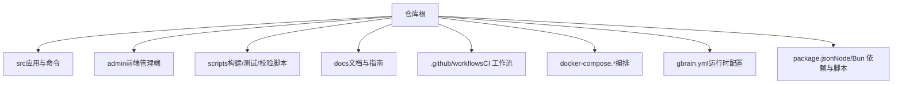
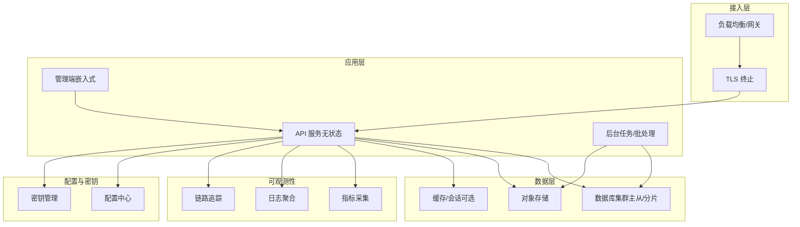
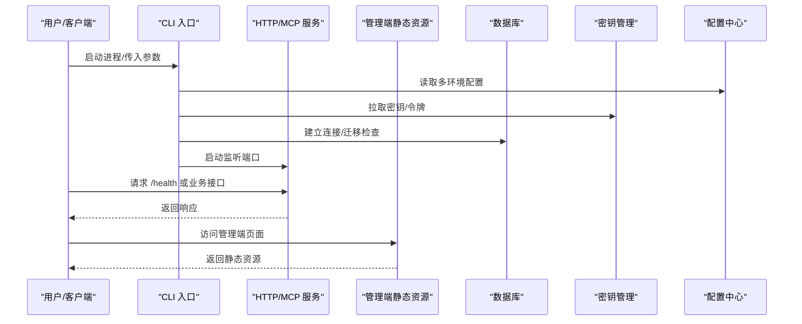
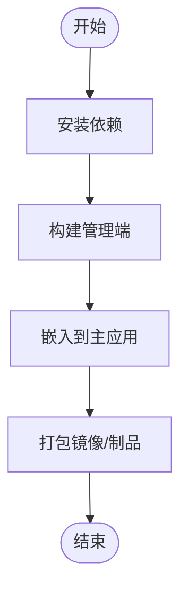
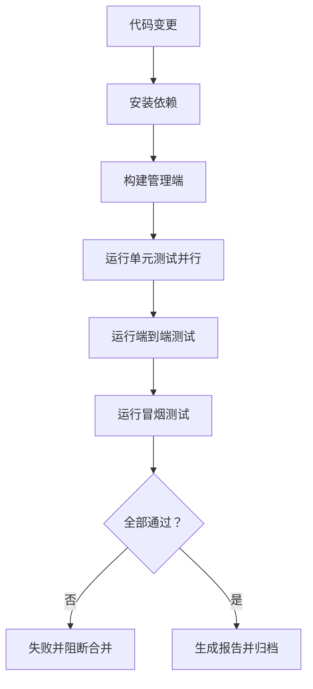
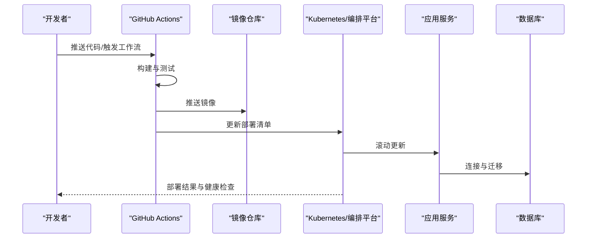
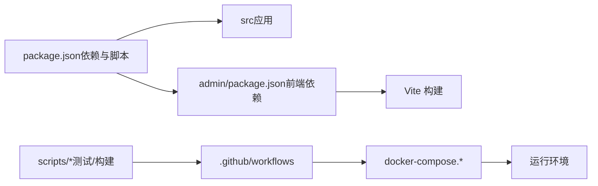

# 部署策略

<cite>
**本文引用的文件**   
- [README.md](file://README.md)
- [INSTALL.md](file://docs/INSTALL.md)
- [docker-compose.ci.yml](file://docker-compose.ci.yml)
- [docker-compose.test.yml](file://docker-compose.test.yml)
- [.github/workflows](file://.github/workflows)
- [gbrain.yml](file://gbrain.yml)
- [package.json](file://package.json)
- [src/cli.ts](file://src/cli.ts)
- [src/admin-embedded.ts](file://src/admin-embedded.ts)
- [scripts/smoke-test.sh](file://scripts/smoke-test.sh)
- [scripts/run-unit-parallel.sh](file://scripts/run-unit-parallel.sh)
- [scripts/run-e2e.sh](file://scripts/run-e2e.sh)
- [scripts/ci-local.sh](file://scripts/ci-local.sh)
- [scripts/build-admin-embedded.ts](file://scripts/build-admin-embedded.ts)
- [admin/package.json](file://admin/package.json)
- [admin/vite.config.ts](file://admin/vite.config.ts)
</cite>

## 目录
1. [简介](#简介)
2. [项目结构](#项目结构)
3. [核心组件](#核心组件)
4. [架构总览](#架构总览)
5. [详细组件分析](#详细组件分析)
6. [依赖关系分析](#依赖关系分析)
7. [性能与容量规划](#性能与容量规划)
8. [故障排查指南](#故障排查指南)
9. [结论](#结论)
10. [附录](#附录)

## 简介
本指南面向生产环境，提供高可用架构设计、容器化部署与云原生集成的综合方案。内容覆盖多环境配置管理、环境变量注入与密钥管理；负载均衡与服务发现、自动扩缩容；数据库集群部署、备份恢复与灾难恢复；CI/CD流水线、自动化测试与灰度发布；监控告警、日志聚合与性能追踪；以及成本优化、资源调度与运维自动化最佳实践。

## 项目结构
仓库采用“应用源码 + 文档 + 脚本 + 前端管理端 + 集成示例”的复合结构：
- 应用入口与命令：位于 src 目录，包含 CLI 与管理端嵌入入口
- 文档与指南：docs 下包含安装、架构、操作等文档
- 构建与运行脚本：scripts 下提供测试、构建与校验脚本
- 前端管理端：admin 子项目，独立包管理与构建配置
- CI/CD 与容器编排：.github/workflows 与 docker-compose.* 文件
- 根级配置：gbrain.yml、package.json 等

**图表来源**
- [package.json:1-200](file://package.json#L1-L200)
- [gbrain.yml:1-200](file://gbrain.yml#L1-L200)
- [docker-compose.ci.yml:1-200](file://docker-compose.ci.yml#L1-L200)
- [docker-compose.test.yml:1-200](file://docker-compose.test.yml#L1-L200)
- [.github/workflows:1-200](file://.github/workflows#L1-L200)

**章节来源**
- [README.md:1-200](file://README.md#L1-L200)
- [docs/INSTALL.md:1-200](file://docs/INSTALL.md#L1-L200)
- [package.json:1-200](file://package.json#L1-L200)
- [gbrain.yml:1-200](file://gbrain.yml#L1-L200)

## 核心组件
- 命令行入口与进程管理：CLI 负责启动、初始化、服务暴露与生命周期管理
- 嵌入式管理端：将前端管理界面打包并随主进程分发，简化部署
- 测试与质量门禁：单元、端到端、冒烟测试与静态检查脚本
- 容器编排与 CI：基于 Compose 的本地/CI 环境与 GitHub Actions 工作流

**章节来源**
- [src/cli.ts:1-200](file://src/cli.ts#L1-L200)
- [src/admin-embedded.ts:1-200](file://src/admin-embedded.ts#L1-L200)
- [scripts/smoke-test.sh:1-200](file://scripts/smoke-test.sh#L1-L200)
- [scripts/run-unit-parallel.sh:1-200](file://scripts/run-unit-parallel.sh#L1-L200)
- [scripts/run-e2e.sh:1-200](file://scripts/run-e2e.sh#L1-L200)
- [scripts/ci-local.sh:1-200](file://scripts/ci-local.sh#L1-L200)
- [scripts/build-admin-embedded.ts:1-200](file://scripts/build-admin-embedded.ts#L1-L200)
- [admin/package.json:1-200](file://admin/package.json#L1-L200)
- [admin/vite.config.ts:1-200](file://admin/vite.config.ts#L1-L200)

## 架构总览
生产环境建议采用“无状态服务 + 外部化配置 + 持久化数据分离”的云原生模式：
- 网关/负载均衡：统一入口、健康检查、TLS 终止
- 应用服务：水平扩展，通过环境变量与密钥管理服务注入配置
- 数据库集群：主从或托管数据库，启用 WAL/快照与跨区复制
- 对象存储：用于附件、导出与归档
- 可观测性：指标、日志、链路追踪集中采集与分析
- 配置中心/密钥库：集中管理多环境配置与敏感信息

[此图为概念性架构图，不直接映射具体源文件]

## 详细组件分析

### 应用入口与生命周期
- CLI 作为进程入口，负责参数解析、配置加载、依赖初始化、HTTP/MCP 服务启动与优雅关闭
- 嵌入式管理端在构建期打包，运行时由主进程提供静态资源与路由，减少部署复杂度

**图表来源**
- [src/cli.ts:1-200](file://src/cli.ts#L1-L200)
- [src/admin-embedded.ts:1-200](file://src/admin-embedded.ts#L1-L200)
- [gbrain.yml:1-200](file://gbrain.yml#L1-L200)

**章节来源**
- [src/cli.ts:1-200](file://src/cli.ts#L1-L200)
- [src/admin-embedded.ts:1-200](file://src/admin-embedded.ts#L1-L200)

### 前端管理端构建与嵌入
- 使用独立包与构建工具进行前端构建，产物由脚本嵌入到主应用
- 通过 Vite 配置控制开发/生产行为，确保生产构建最小化与安全加固

**图表来源**
- [scripts/build-admin-embedded.ts:1-200](file://scripts/build-admin-embedded.ts#L1-L200)
- [admin/package.json:1-200](file://admin/package.json#L1-L200)
- [admin/vite.config.ts:1-200](file://admin/vite.config.ts#L1-L200)

**章节来源**
- [scripts/build-admin-embedded.ts:1-200](file://scripts/build-admin-embedded.ts#L1-L200)
- [admin/package.json:1-200](file://admin/package.json#L1-L200)
- [admin/vite.config.ts:1-200](file://admin/vite.config.ts#L1-L200)

### 测试与质量门禁
- 单元测试并行执行，端到端与冒烟测试覆盖关键路径
- CI 本地脚本串联构建、测试与校验，保证提交质量

**图表来源**
- [scripts/run-unit-parallel.sh:1-200](file://scripts/run-unit-parallel.sh#L1-L200)
- [scripts/run-e2e.sh:1-200](file://scripts/run-e2e.sh#L1-L200)
- [scripts/smoke-test.sh:1-200](file://scripts/smoke-test.sh#L1-L200)
- [scripts/ci-local.sh:1-200](file://scripts/ci-local.sh#L1-L200)

**章节来源**
- [scripts/run-unit-parallel.sh:1-200](file://scripts/run-unit-parallel.sh#L1-L200)
- [scripts/run-e2e.sh:1-200](file://scripts/run-e2e.sh#L1-L200)
- [scripts/smoke-test.sh:1-200](file://scripts/smoke-test.sh#L1-L200)
- [scripts/ci-local.sh:1-200](file://scripts/ci-local.sh#L1-L200)

### 容器编排与 CI/CD
- 使用 Compose 定义本地与 CI 环境的服务拓扑（应用、数据库、缓存等）
- GitHub Actions 工作流驱动构建、测试、镜像推送与部署

**图表来源**
- [docker-compose.ci.yml:1-200](file://docker-compose.ci.yml#L1-L200)
- [docker-compose.test.yml:1-200](file://docker-compose.test.yml#L1-L200)
- [.github/workflows:1-200](file://.github/workflows#L1-L200)

**章节来源**
- [docker-compose.ci.yml:1-200](file://docker-compose.ci.yml#L1-L200)
- [docker-compose.test.yml:1-200](file://docker-compose.test.yml#L1-L200)
- [.github/workflows:1-200](file://.github/workflows#L1-L200)

## 依赖关系分析
- 运行时依赖：Node/Bun 运行时、数据库驱动、网络栈
- 构建依赖：前端构建工具链、类型检查与打包插件
- 外部服务：数据库、对象存储、密钥管理、可观测性后端

**图表来源**
- [package.json:1-200](file://package.json#L1-L200)
- [admin/package.json:1-200](file://admin/package.json#L1-L200)
- [admin/vite.config.ts:1-200](file://admin/vite.config.ts#L1-L200)
- [scripts/run-unit-parallel.sh:1-200](file://scripts/run-unit-parallel.sh#L1-L200)
- [scripts/run-e2e.sh:1-200](file://scripts/run-e2e.sh#L1-L200)
- [scripts/smoke-test.sh:1-200](file://scripts/smoke-test.sh#L1-L200)
- [scripts/ci-local.sh:1-200](file://scripts/ci-local.sh#L1-L200)
- [docker-compose.ci.yml:1-200](file://docker-compose.ci.yml#L1-L200)
- [docker-compose.test.yml:1-200](file://docker-compose.test.yml#L1-L200)
- [.github/workflows:1-200](file://.github/workflows#L1-L200)

**章节来源**
- [package.json:1-200](file://package.json#L1-L200)
- [admin/package.json:1-200](file://admin/package.json#L1-L200)
- [admin/vite.config.ts:1-200](file://admin/vite.config.ts#L1-L200)
- [scripts/run-unit-parallel.sh:1-200](file://scripts/run-unit-parallel.sh#L1-L200)
- [scripts/run-e2e.sh:1-200](file://scripts/run-e2e.sh#L1-L200)
- [scripts/smoke-test.sh:1-200](file://scripts/smoke-test.sh#L1-L200)
- [scripts/ci-local.sh:1-200](file://scripts/ci-local.sh#L1-L200)
- [docker-compose.ci.yml:1-200](file://docker-compose.ci.yml#L1-L200)
- [docker-compose.test.yml:1-200](file://docker-compose.test.yml#L1-L200)
- [.github/workflows:1-200](file://.github/workflows#L1-L200)

## 性能与容量规划
- 水平扩展：将应用服务设置为无状态，按 CPU/内存/QPS 指标自动扩缩容
- 连接池与超时：合理设置数据库连接池大小、读写超时与重试退避
- 缓存策略：热点数据入缓存，注意一致性、失效与穿透防护
- 资源配额：为每个副本设定 requests/limits，避免资源争用与 OOM
- 批量与异步：对重计算与导入任务采用队列与批处理，削峰填谷

[本节为通用指导，无需特定文件引用]

## 故障排查指南
- 健康检查：实现 /health 与 /ready 探针，结合负载均衡与编排平台进行流量摘除
- 日志规范：结构化输出，包含请求 ID、租户/脑标识、阶段与耗时
- 错误分类：区分可重试与不可重试错误，记录上下文与堆栈摘要
- 回滚策略：保留上一版本镜像与配置，支持快速回滚
- 演练与复盘：定期开展故障演练，完善 Runbook 与告警阈值

**章节来源**
- [scripts/smoke-test.sh:1-200](file://scripts/smoke-test.sh#L1-L200)
- [scripts/ci-local.sh:1-200](file://scripts/ci-local.sh#L1-L200)

## 结论
通过无状态服务、外部化配置与密钥管理、数据库高可用与备份恢复、完善的 CI/CD 与自动化测试、以及全面的可观测性与灰度发布策略，可在云原生环境中实现稳定、可扩展且易运维的生产系统。持续的成本优化与资源调度将进一步降低 TCO 并提升交付效率。

[本节为总结性内容，无需特定文件引用]

## 附录

### 多环境配置与环境变量注入
- 配置分层：默认配置 + 环境覆盖 + 运行时注入
- 环境变量命名规范：前缀区分环境，避免硬编码
- 密钥管理：使用平台密钥服务或外部 KMS，运行时动态拉取
- 配置校验：启动时校验必填项与格式，失败即中止

**章节来源**
- [gbrain.yml:1-200](file://gbrain.yml#L1-L200)
- [src/cli.ts:1-200](file://src/cli.ts#L1-L200)

### 负载均衡、服务发现与自动扩缩容
- 负载均衡：七层代理或 Ingress，开启健康检查与熔断
- 服务发现：Kubernetes Service/DNS 或外部注册中心
- 自动扩缩容：HPA/VPA 基于 CPU/内存/自定义指标调整副本数

**章节来源**
- [docker-compose.ci.yml:1-200](file://docker-compose.ci.yml#L1-L200)
- [docker-compose.test.yml:1-200](file://docker-compose.test.yml#L1-L200)

### 数据库集群、备份恢复与灾难恢复
- 集群模式：主从/多活，读写分离与故障转移
- 备份策略：全量快照 + 增量 WAL，跨区/跨账号复制
- 恢复演练：定期验证 RTO/RPO，制定回滚与降级方案

**章节来源**
- [docker-compose.ci.yml:1-200](file://docker-compose.ci.yml#L1-L200)
- [docker-compose.test.yml:1-200](file://docker-compose.test.yml#L1-L200)

### CI/CD 流水线、自动化测试与灰度发布
- 流水线：构建 → 测试 → 安全扫描 → 镜像推送 → 部署
- 自动化测试：单元、集成、端到端与冒烟测试全覆盖
- 灰度发布：蓝绿/金丝雀，逐步放量与快速回滚

**章节来源**
- [.github/workflows:1-200](file://.github/workflows#L1-L200)
- [scripts/run-unit-parallel.sh:1-200](file://scripts/run-unit-parallel.sh#L1-L200)
- [scripts/run-e2e.sh:1-200](file://scripts/run-e2e.sh#L1-L200)
- [scripts/smoke-test.sh:1-200](file://scripts/smoke-test.sh#L1-L200)

### 监控告警、日志聚合与性能追踪
- 指标：QPS、延迟、错误率、资源使用、队列积压
- 日志：集中采集、检索与审计，脱敏敏感字段
- 追踪：分布式链路追踪，定位慢调用与瓶颈

**章节来源**
- [src/cli.ts:1-200](file://src/cli.ts#L1-L200)
- [scripts/ci-local.sh:1-200](file://scripts/ci-local.sh#L1-L200)

### 成本优化、资源调度与运维自动化
- 成本优化：按需实例、预留实例与竞价实例组合，冷热数据分层
- 资源调度：requests/limits 精细化，避免过度分配
- 运维自动化：基础设施即代码、一键回滚、自愈与自愈式扩容

**章节来源**
- [docker-compose.ci.yml:1-200](file://docker-compose.ci.yml#L1-L200)
- [docker-compose.test.yml:1-200](file://docker-compose.test.yml#L1-L200)