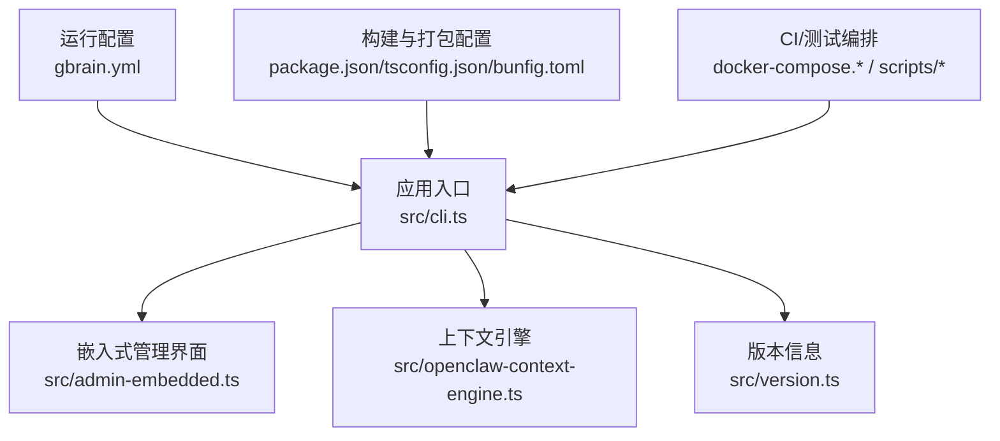
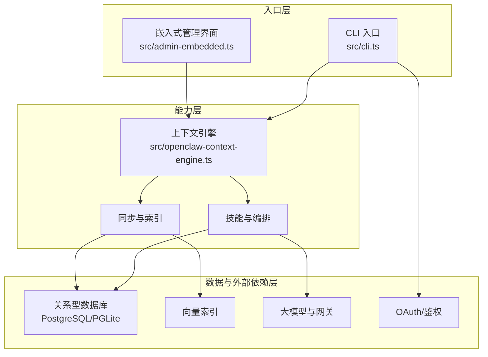
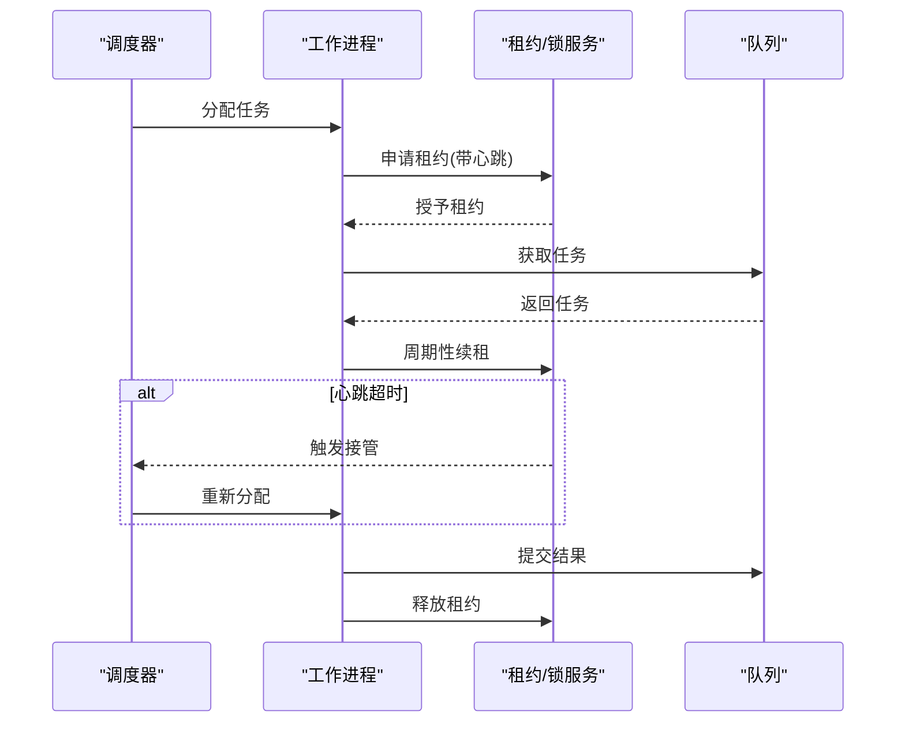
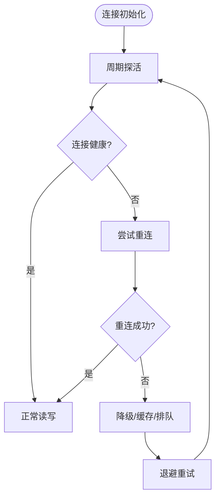
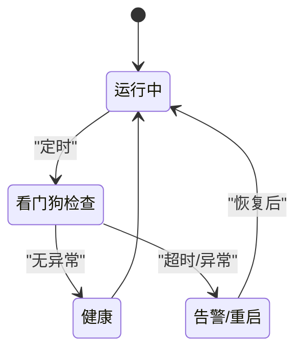
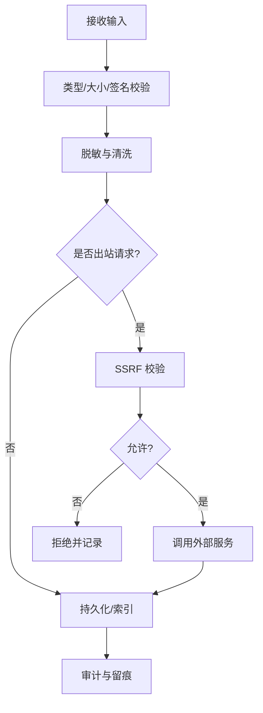
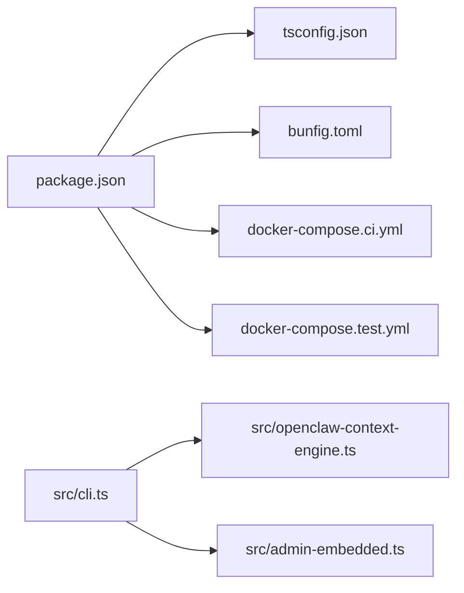
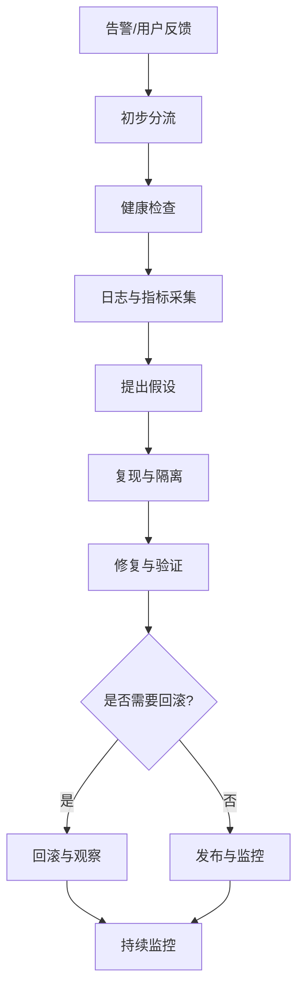

# 高级主题

<cite>
**本文引用的文件**   
- [README.md](file://README.md)
- [SECURITY.md](file://SECURITY.md)
- [DESIGN.md](file://DESIGN.md)
- [CLAUDE.md](file://CLAUDE.md)
- [AGENTS.md](file://AGENTS.md)
- [gbrain.yml](file://gbrain.yml)
- [package.json](file://package.json)
- [tsconfig.json](file://tsconfig.json)
- [bunfig.toml](file://bunfig.toml)
- [docker-compose.ci.yml](file://docker-compose.ci.yml)
- [docker-compose.test.yml](file://docker-compose.test.yml)
- [src/cli.ts](file://src/cli.ts)
- [src/admin-embedded.ts](file://src/admin-embedded.ts)
- [src/openclaw-context-engine.ts](file://src/openclaw-context-engine.ts)
- [src/version.ts](file://src/version.ts)
- [scripts/run-unit-parallel.sh](file://scripts/run-unit-parallel.sh)
- [scripts/run-heavy.sh](file://scripts/run-heavy.sh)
- [scripts/profile-tests.sh](file://scripts/profile-tests.sh)
- [scripts/ci-local.sh](file://scripts/ci-local.sh)
- [scripts/smoke-test.sh](file://scripts/smoke-test.sh)
- [scripts/check-no-double-retry.sh](file://scripts/check-no-double-retry.sh)
- [scripts/check-worker-lock-renewal-shape.sh](file://scripts/check-worker-lock-renewal-shape.sh)
- [scripts/check-worker-pool-atomicity.sh](file://scripts/check-worker-pool-atomicity.sh)
- [scripts/worker-supervised-db-probe.test.ts](file://test/worker-supervised-db-probe.test.ts)
- [test/postgres-engine-getter-selfheal.test.ts](file://test/postgres-engine-getter-selfheal.test.ts)
- [test/pglite-engine-disconnect.serial.test.ts](file://test/pglite-engine-disconnect.serial.test.ts)
- [test/pglite-reconnect.serial.test.ts](file://test/pglite-reconnect.serial.test.ts)
- [test/db-lock-auto-takeover.test.ts](file://test/db-lock-auto-takeover.test.ts)
- [test/db-lock-heartbeat-takeover.test.ts](file://test/db-lock-heartbeat-takeover.test.ts)
- [test/db-lock-refresh.test.ts](file://test/db-lock-refresh.test.ts)
- [test/queue-lock-retry.test.ts](file://test/queue-lock-retry.test.ts)
- [test/sync-failure-ledger.serial.test.ts](file://test/sync-failure-ledger.serial.test.ts)
- [test/doctor-worker-oom-loop.test.ts](file://test/doctor-worker-oom-loop.test.ts)
- [test/process-watchdog.test.ts](file://test/process-watchdog.test.ts)
- [test/process-watchdog.serial.test.ts](file://test/process-watchdog.serial.test.ts)
- [test/worker-watchdog-trigger.test.ts](file://test/worker-watchdog-trigger.test.ts)
- [test/worker-lock-renewal-e2e.serial.test.ts](file://test/worker-lock-renewal-e2e.serial.test.ts)
- [test/worker-lock-renewal-shape.test.ts](file://test/worker-lock-renewal-shape.test.ts)
- [test/worker-lock-renewal.test.ts](file://test/worker-lock-renewal.test.ts)
- [test/worker-pool.test.ts](file://test/worker-pool.test.ts)
- [test/worker-rss.test.ts](file://test/worker-rss.test.ts)
- [test/worker-shutdown-disconnect.test.ts](file://test/worker-shutdown-disconnect.test.ts)
- [test/serve-http-health.test.ts](file://test/serve-http-health.test.ts)
- [test/serve-http-cors.test.ts](file://test/serve-http-cors.test.ts)
- [test/serve-http-trust-proxy.test.ts](file://test/serve-http-trust-proxy.test.ts)
- [test/file-upload-security.test.ts](file://test/file-upload-security.test.ts)
- [test/mcp-client-hardening.test.ts](file://test/mcp-client-hardening.test.ts)
- [test/ssrf-validate.test.ts](file://test/ssrf-validate.test.ts)
- [test/oauth.test.ts](file://test/oauth.test.ts)
- [test/oauth-authorize-scope-probe.test.ts](file://test/oauth-authorize-scope-probe.test.ts)
- [test/oauth-confidential-client.test.ts](file://test/oauth-confidential-client.test.ts)
- [test/guardrails.test.ts](file://test/guardrails.test.ts)
- [test/trust-boundary-contract.test.ts](file://test/trust-boundary-contract.test.ts)
- [test/operations-trust-boundary.test.ts](file://test/operations-trust-boundary.test.ts)
- [test/privacy-script-wired.test.ts](file://test/privacy-script-wired.test.ts)
- [test/privacy-strip-and-forget.test.ts](file://test/privacy-strip-and-forget.test.ts)
- [test/url-redact.test.ts](file://test/url-redact.test.ts)
- [test/source-config-redact.test.ts](file://test/source-config-redact.test.ts)
- [test/check-pg-url-redaction.sh](file://scripts/check-pg-url-redaction.sh)
- [test/check-source-config-leak.sh](file://scripts/check-source-config-leak.sh)
- [test/check-privacy.sh](file://scripts/check-privacy.sh)
- [test/check-no-pii-in-agent-voice.sh](file://scripts/check-no-pii-in-agent-voice.sh)
- [test/check-fixture-privacy.sh](file://scripts/check-fixture-privacy.sh)
- [test/check-proposal-pii.sh](file://scripts/check-proposal-pii.sh)
- [test/check-system-of-record.sh](file://scripts/check-system-of-record.sh)
- [test/check-jsonb-params.mjs](file://scripts/check-jsonb-params.mjs)
- [test/check-key-files-current-state.sh](file://scripts/check-key-files-current-state.sh)
- [test/check-image-decoders-embedded.sh](file://scripts/check-image-decoders-embedded.sh)
- [test/check-wasm-embedded.sh](file://scripts/check-wasm-embedded.sh)
- [test/check-batch-audit-site.sh](file://scripts/check-batch-audit-site.sh)
- [test/check-exports-count.sh](file://scripts/check-exports-count.sh)
- [test/check-admin-build.sh](file://scripts/check-admin-build.sh)
- [test/check-admin-embedded.sh](file://scripts/check-admin-embedded.sh)
- [test/check-admin-scope-drift.sh](file://scripts/check-admin-scope-drift.sh)
- [test/check-gateway-routed-no-direct-anthropic.sh](file://scripts/check-gateway-routed-no-direct-anthropic.sh)
- [test/check-operations-filter-bypass.sh](file://scripts/check-operations-filter-bypass.sh)
- [test/check-progress-to-stdout.sh](file://scripts/check-progress-to-stdout.sh)
- [test/check-skill-brain-first.sh](file://scripts/check-skill-brain-first.sh)
- [test/check-source-id-projection.sh](file://scripts/check-source-id-projection.sh)
- [test/check-source-scope-onboard.sh](file://scripts/check-source-scope-onboard.sh)
- [test/check-synthetic-corpus-privacy.sh](file://scripts/check-synthetic-corpus-privacy.sh)
- [test/check-trailing-newline.sh](file://scripts/check-trailing-newline.sh)
- [test/check-test-isolation.allowlist](file://scripts/check-test-isolation.allowlist)
- [test/check-test-isolation.sh](file://scripts/check-test-isolation.sh)
- [test/check-test-real-names.sh](file://scripts/check-test-real-names.sh)
- [test/e5-lease-cap-ab.ts](file://scripts/e5-lease-cap-ab.ts)
- [test/sharding.ts](file://scripts/sharding.ts)
- [test/test-weights.json](file://scripts/test-weights.json)
- [test/select-e2e.ts](file://scripts/select-e2e.ts)
- [test/run-e2e.sh](file://scripts/run-e2e.sh)
- [test/run-serial-tests.sh](file://scripts/run-serial-tests.sh)
- [test/run-slow-tests.sh](file://scripts/run-slow-tests.sh)
- [test/run-unit-parallel.sh](file://scripts/run-unit-parallel.sh)
- [test/run-unit-shard.sh](file://scripts/run-unit-shard.sh)
- [test/ship-remote-tests.sh](file://scripts/ship-remote-tests.sh)
- [test/skillify-check.ts](file://scripts/skillify-check.ts)
- [test/smoke-test-mcp.ts](file://scripts/smoke-test-mcp.ts)
- [test/spike-bun-vm-timeout.ts](file://scripts/spike-bun-vm-timeout.ts)
- [test/test-shard.sh](file://scripts/test-shard.sh)
- [test/benchmark-graph-quality.ts](file://test/benchmark-graph-quality.ts)
- [test/benchmark-knowledge-runtime.ts](file://test/benchmark-knowledge-runtime.ts)
- [test/benchmark-put-page-latency.ts](file://test/benchmark-put-page-latency.ts)
- [test/benchmark-search-quality.ts](file://test/benchmark-search-quality.ts)
- [test/entity-resolve-perf.slow.test.ts](file://test/entity-resolve-perf.slow.test.ts)
- [test/reindex-code-max-cost.serial.test.ts](file://test/reindex-code-max-cost.serial.test.ts)
- [test/sync-cost-estimate.test.ts](file://test/sync-cost-estimate.test.ts)
- [test/sync-cost-gate.serial.test.ts](file://test/sync-cost-gate.serial.test.ts)
- [test/sync-cost-preview.test.ts](file://test/sync-cost-preview.test.ts)
- [test/token-budget.test.ts](file://test/token-budget.test.ts)
- [test/embed-multimodal-batching.test.ts](file://test/embed-multimodal-batching.test.ts)
- [test/query-cache.test.ts](file://test/query-cache.test.ts)
- [test/query-cache-gate.test.ts](file://test/query-cache-gate.test.ts)
- [test/query-cache-knobs-hash.serial.test.ts](file://test/query-cache-knobs-hash.serial.test.ts)
- [test/backoff.test.ts](file://test/backoff.test.ts)
- [test/rate-leases.test.ts](file://test/rate-leases.test.ts)
- [test/rate-leases-uncapped.test.ts](file://test/rate-leases-uncapped.test.ts)
- [test/lease-cap-controller.test.ts](file://test/lease-cap-controller.test.ts)
- [test/progress-events.test.ts](file://test/progress-events.test.ts)
- [test/progress-tail.test.ts](file://test/progress-tail.test.ts)
- [test/timeout.test.ts](file://test/timeout.test.ts)
- [test/abort-check.test.ts](file://test/abort-check.test.ts)
- [test/exit-classification.test.ts](file://test/exit-classification.test.ts)
- [test/flush-then-exit-harness.test.ts](file://test/flush-then-exit-harness.test.ts)
- [test/zombie-reap.test.ts](file://test/zombie-reap.test.ts)
- [test/process-cleanup.test.ts](file://test/process-cleanup.test.ts)
- [test/doctor-child-orphans.test.ts](file://test/doctor-child-orphans.test.ts)
- [test/doctor-pool-reap-health.test.ts](file://test/doctor-pool-reap-health.test.ts)
- [test/doctor-subagent-health.test.ts](file://test/doctor-subagent-health.test.ts)
- [test/doctor-cycle-freshness.test.ts](file://test/doctor-cycle-freshness.test.ts)
- [test/doctor-federation-health.test.ts](file://test/doctor-federation-health.test.ts)
- [test/doctor-minions-check.test.ts](file://test/doctor-minions-check.test.ts)
- [test/doctor-self-upgrade.test.ts](file://test/doctor-self-upgrade.test.ts)
- [test/doctor-v0_37_7_checks.test.ts](file://test/doctor-v0_37_7_checks.test.ts)
- [test/doctor-v0_41_13_checks.test.ts](file://test/doctor-v0_41_13_checks.test.ts)
- [test/doctor-wedged-queue.test.ts](file://test/doctor-wedged-queue.test.ts)
- [test/doctor.test.ts](file://test/doctor.test.ts)
- [test/doctor-cli-smoke.serial.test.ts](file://test/doctor-cli-smoke.serial.test.ts)
- [test/doctor-behavioral.test.ts](file://test/doctor-behavioral.test.ts)
- [test/doctor-fix.test.ts](file://test/doctor-fix.test.ts)
- [test/doctor-report-remote.serial.test.ts](file://test/doctor-report-remote.serial.test.ts)
- [test/doctor-ze-checks.test.ts](file://test/doctor-ze-checks.test.ts)
- [test/doctor-autopilot-fanout-concurrency.serial.test.ts](file://test/doctor-autopilot-fanout-concurrency.serial.test.ts)
- [test/doctor-batch-retry.test.ts](file://test/doctor-batch-retry.test.ts)
- [test/doctor-brain-checks-score.test.ts](file://test/doctor-brain-checks-score.test.ts)
- [test/doctor-calibration-checks.test.ts](file://test/doctor-calibration-checks.test.ts)
- [test/doctor-categories.test.ts](file://test/doctor-categories.test.ts)
- [test/doctor-cause-rank.test.ts](file://test/doctor-cause-rank.test.ts)
- [test/doctor-extract-atoms-backlog.test.ts](file://test/doctor-extract-atoms-backlog.test.ts)
- [test/doctor-extract-health.test.ts](file://test/doctor-extract-health.test.ts)
- [test/doctor-home-dir-in-worktree.test.ts](file://test/doctor-home-dir-in-worktree.test.ts)
- [test/doctor-links-extraction-lag.test.ts](file://test/doctor-links-extraction-lag.test.ts)
- [test/doctor-orphan-ratio.test.ts](file://test/doctor-orphan-ratio.test.ts)
- [test/doctor-retrieval-reflex.test.ts](file://test/doctor-retrieval-reflex.test.ts)
- [test/doctor-scope-filter.test.ts](file://test/doctor-scope-filter.test.ts)
- [test/doctor-search-mode.test.ts](file://test/doctor-search-mode.test.ts)
- [test/doctor-sync-consolidation.test.ts](file://test/doctor-sync-consolidation.test.ts)
- [test/doctor-remote.serial.test.ts](file://test/doctor-remote.serial.test.ts)
- [test/doctor-subagent-health.test.ts](file://test/doctor-subagent-health.test.ts)
</cite>

## 目录
1. [简介](#简介)
2. [项目结构](#项目结构)
3. [核心组件](#核心组件)
4. [架构总览](#架构总览)
5. [详细组件分析](#详细组件分析)
6. [依赖分析](#依赖分析)
7. [性能考虑](#性能考虑)
8. [故障排查指南](#故障排查指南)
9. [结论](#结论)
10. [附录](#附录)

## 简介
本“高级主题”文档聚焦于系统级专家能力：性能优化、安全与合规、扩展与插件化、复杂故障诊断、大规模高可用部署与灾难恢复，以及新技术集成与演进路线。内容基于仓库中的源码、测试与脚本证据进行归纳，确保可追溯、可验证，并兼顾非技术读者的可读性。

## 项目结构
仓库采用多模块组织方式：
- src：核心运行时入口、CLI、嵌入式管理界面、上下文引擎与版本信息
- test：覆盖功能、性能、并发、锁、数据库连接、进程守护、安全与隐私等大量用例
- scripts：构建、CI、质量门禁、基准与压测、探针与检查脚本
- docs：架构、设计、运维、迁移、评估、技能包规范等文档
- admin：前端管理界面（独立工程）
- skills：内置技能包集合
- recipes：典型集成与编排示例
- evals：评测集与评测工具链

图示来源
- [src/cli.ts](file://src/cli.ts)
- [src/admin-embedded.ts](file://src/admin-embedded.ts)
- [src/openclaw-context-engine.ts](file://src/openclaw-context-engine.ts)
- [src/version.ts](file://src/version.ts)
- [gbrain.yml](file://gbrain.yml)
- [package.json](file://package.json)
- [tsconfig.json](file://tsconfig.json)
- [bunfig.toml](file://bunfig.toml)
- [docker-compose.ci.yml](file://docker-compose.ci.yml)
- [docker-compose.test.yml](file://docker-compose.test.yml)

章节来源
- [README.md](file://README.md)
- [DESIGN.md](file://DESIGN.md)
- [CLAUDE.md](file://CLAUDE.md)
- [AGENTS.md](file://AGENTS.md)
- [gbrain.yml](file://gbrain.yml)
- [package.json](file://package.json)
- [tsconfig.json](file://tsconfig.json)
- [bunfig.toml](file://bunfig.toml)
- [docker-compose.ci.yml](file://docker-compose.ci.yml)
- [docker-compose.test.yml](file://docker-compose.test.yml)

## 核心组件
- CLI 与启动流程：负责命令解析、子命令分发、服务生命周期管理、健康检查与退出码分类
- 嵌入式管理界面：提供本地或内嵌的管理能力，受作用域与安全策略约束
- 上下文引擎：为上层能力提供统一上下文装配与注入机制
- 版本与兼容性：集中管理版本信息与升级路径

章节来源
- [src/cli.ts](file://src/cli.ts)
- [src/admin-embedded.ts](file://src/admin-embedded.ts)
- [src/openclaw-context-engine.ts](file://src/openclaw-context-engine.ts)
- [src/version.ts](file://src/version.ts)

## 架构总览
从运行期视角，系统由“入口层—能力层—数据与外部依赖层”构成：
- 入口层：CLI 暴露命令与 HTTP 服务；嵌入式管理界面提供操作面
- 能力层：上下文引擎驱动任务编排、技能执行、检索与索引、同步与增量更新
- 数据与外部依赖层：PostgreSQL/PGLite、向量索引、对象存储、第三方模型与认证网关

图示来源
- [src/cli.ts](file://src/cli.ts)
- [src/admin-embedded.ts](file://src/admin-embedded.ts)
- [src/openclaw-context-engine.ts](file://src/openclaw-context-engine.ts)

## 详细组件分析

### 并发与锁：工作池、租约与心跳
- 工作池与隔离：通过工作池控制并发度，结合租约与心跳避免重复执行与僵尸任务
- 锁续租与抢占：支持自动续租、心跳超时接管与分布式抢占，保障幂等与一致性
- 队列锁重试：对关键队列操作实现指数退避与最大重试上限，降低抖动影响

图示来源
- [test/worker-lock-renewal-e2e.serial.test.ts](file://test/worker-lock-renewal-e2e.serial.test.ts)
- [test/worker-lock-renewal-shape.test.ts](file://test/worker-lock-renewal-shape.test.ts)
- [test/worker-lock-renewal.test.ts](file://test/worker-lock-renewal.test.ts)
- [test/queue-lock-retry.test.ts](file://test/queue-lock-retry.test.ts)
- [test/worker-pool.test.ts](file://test/worker-pool.test.ts)
- [scripts/check-worker-lock-renewal-shape.sh](file://scripts/check-worker-lock-renewal-shape.sh)
- [scripts/check-worker-pool-atomicity.sh](file://scripts/check-worker-pool-atomicity.sh)

章节来源
- [test/worker-lock-renewal-e2e.serial.test.ts](file://test/worker-lock-renewal-e2e.serial.test.ts)
- [test/worker-lock-renewal-shape.test.ts](file://test/worker-lock-renewal-shape.test.ts)
- [test/worker-lock-renewal.test.ts](file://test/worker-lock-renewal.test.ts)
- [test/queue-lock-retry.test.ts](file://test/queue-lock-retry.test.ts)
- [test/worker-pool.test.ts](file://test/worker-pool.test.ts)
- [scripts/check-worker-lock-renewal-shape.sh](file://scripts/check-worker-lock-renewal-shape.sh)
- [scripts/check-worker-pool-atomicity.sh](file://scripts/check-worker-pool-atomicity.sh)

### 数据库连接弹性：断线重连与自愈
- 断线检测与重连：针对 PG/PGLite 的断开场景，具备自动探测与重连逻辑
- 自愈合获取器：在连接不可用时回退到缓存或降级路径，保证可用性
- 心跳探活：定期探测数据库连通性，提前发现异常

图示来源
- [test/pglite-engine-disconnect.serial.test.ts](file://test/pglite-engine-disconnect.serial.test.ts)
- [test/pglite-reconnect.serial.test.ts](file://test/pglite-reconnect.serial.test.ts)
- [test/postgres-engine-getter-selfheal.test.ts](file://test/postgres-engine-getter-selfheal.test.ts)
- [test/worker-supervised-db-probe.test.ts](file://test/worker-supervised-db-probe.test.ts)

章节来源
- [test/pglite-engine-disconnect.serial.test.ts](file://test/pglite-engine-disconnect.serial.test.ts)
- [test/pglite-reconnect.serial.test.ts](file://test/pglite-reconnect.serial.test.ts)
- [test/postgres-engine-getter-selfheal.test.ts](file://test/postgres-engine-getter-selfheal.test.ts)
- [test/worker-supervised-db-probe.test.ts](file://test/worker-supervised-db-probe.test.ts)

### 进程守护与资源回收
- 看门狗与超时：监控长耗时任务与阻塞点，触发告警或重启
- 僵尸进程清理：防止孤儿进程占用资源
- OOM 循环防护：识别内存泄漏导致的反复崩溃，采取限流或降级

图示来源
- [test/process-watchdog.test.ts](file://test/process-watchdog.test.ts)
- [test/process-watchdog.serial.test.ts](file://test/process-watchdog.serial.test.ts)
- [test/worker-watchdog-trigger.test.ts](file://test/worker-watchdog-trigger.test.ts)
- [test/doctor-worker-oom-loop.test.ts](file://test/doctor-worker-oom-loop.test.ts)
- [test/zombie-reap.test.ts](file://test/zombie-reap.test.ts)
- [test/process-cleanup.test.ts](file://test/process-cleanup.test.ts)

章节来源
- [test/process-watchdog.test.ts](file://test/process-watchdog.test.ts)
- [test/process-watchdog.serial.test.ts](file://test/process-watchdog.serial.test.ts)
- [test/worker-watchdog-trigger.test.ts](file://test/worker-watchdog-trigger.test.ts)
- [test/doctor-worker-oom-loop.test.ts](file://test/doctor-worker-oom-loop.test.ts)
- [test/zombie-reap.test.ts](file://test/zombie-reap.test.ts)
- [test/process-cleanup.test.ts](file://test/process-cleanup.test.ts)

### 安全与合规：上传、SSRF、OAuth、脱敏与审计
- 文件上传安全：类型白名单、大小限制、病毒扫描与沙箱处理
- SSRF 防护：对外请求域名白名单与协议校验
- OAuth 与最小权限：授权范围探测、机密客户端保护
- 敏感信息脱敏：URL、配置、日志与产物中的 PII 过滤
- 信任边界与操作审计：跨租户隔离、操作审计与合规留痕

图示来源
- [test/file-upload-security.test.ts](file://test/file-upload-security.test.ts)
- [test/ssrf-validate.test.ts](file://test/ssrf-validate.test.ts)
- [test/oauth.test.ts](file://test/oauth.test.ts)
- [test/oauth-authorize-scope-probe.test.ts](file://test/oauth-authorize-scope-probe.test.ts)
- [test/oauth-confidential-client.test.ts](file://test/oauth-confidential-client.test.ts)
- [test/url-redact.test.ts](file://test/url-redact.test.ts)
- [test/source-config-redact.test.ts](file://test/source-config-redact.test.ts)
- [test/privacy-script-wired.test.ts](file://test/privacy-script-wired.test.ts)
- [test/privacy-strip-and-forget.test.ts](file://test/privacy-strip-and-forget.test.ts)
- [test/guardrails.test.ts](file://test/guardrails.test.ts)
- [test/trust-boundary-contract.test.ts](file://test/trust-boundary-contract.test.ts)
- [test/operations-trust-boundary.test.ts](file://test/operations-trust-boundary.test.ts)

章节来源
- [test/file-upload-security.test.ts](file://test/file-upload-security.test.ts)
- [test/ssrf-validate.test.ts](file://test/ssrf-validate.test.ts)
- [test/oauth.test.ts](file://test/oauth.test.ts)
- [test/oauth-authorize-scope-probe.test.ts](file://test/oauth-authorize-scope-probe.test.ts)
- [test/oauth-confidential-client.test.ts](file://test/oauth-confidential-client.test.ts)
- [test/url-redact.test.ts](file://test/url-redact.test.ts)
- [test/source-config-redact.test.ts](file://test/source-config-redact.test.ts)
- [test/privacy-script-wired.test.ts](file://test/privacy-script-wired.test.ts)
- [test/privacy-strip-and-forget.test.ts](file://test/privacy-strip-and-forget.test.ts)
- [test/guardrails.test.ts](file://test/guardrails.test.ts)
- [test/trust-boundary-contract.test.ts](file://test/trust-boundary-contract.test.ts)
- [test/operations-trust-boundary.test.ts](file://test/operations-trust-boundary.test.ts)

### 可扩展性与插件化：技能包与注册表
- 技能包清单与加载：通过清单描述能力、依赖与元数据，支持动态发现与热插拔
- 注册表与版本治理：版本兼容、冲突检测与回滚策略
- 钩子与事件：在关键阶段注入自定义逻辑，如前置校验、后置审计

章节来源
- [skills/_AGENT_README.md](file://skills/_AGENT_README.md)
- [skills/manifest.json](file://skills/manifest.json)
- [docs/GBRAIN_SKILLPACK.md](file://docs/GBRAIN_SKILLPACK.md)
- [docs/skillpack-anatomy.md](file://docs/skillpack-anatomy.md)

### 高可用与容灾：复制、切换与演练
- 主从与只读副本：读写分离与故障转移
- 备份与快照：全量与增量备份、时间点恢复
- 演练与混沌：定期演练切换与恢复流程，验证 RTO/RPO

章节来源
- [docker-compose.ci.yml](file://docker-compose.ci.yml)
- [docker-compose.test.yml](file://docker-compose.test.yml)

## 依赖分析
- 运行时依赖：Node/Bun 运行时、数据库驱动、HTTP 框架、向量库
- 构建与测试：TypeScript、Bun 配置、并行测试与分片执行
- CI/CD：容器编排、质量门禁与回归测试

图示来源
- [package.json](file://package.json)
- [tsconfig.json](file://tsconfig.json)
- [bunfig.toml](file://bunfig.toml)
- [docker-compose.ci.yml](file://docker-compose.ci.yml)
- [docker-compose.test.yml](file://docker-compose.test.yml)
- [src/cli.ts](file://src/cli.ts)
- [src/openclaw-context-engine.ts](file://src/openclaw-context-engine.ts)
- [src/admin-embedded.ts](file://src/admin-embedded.ts)

章节来源
- [package.json](file://package.json)
- [tsconfig.json](file://tsconfig.json)
- [bunfig.toml](file://bunfig.toml)
- [docker-compose.ci.yml](file://docker-compose.ci.yml)
- [docker-compose.test.yml](file://docker-compose.test.yml)

## 性能考虑
- 并发与吞吐
  - 工作池容量与任务粒度调优，避免过度竞争与上下文切换开销
  - 租约与锁的批量合并与去抖，减少锁争用
- 数据库与索引
  - 连接池大小、查询计划与索引选择，关注慢查询与锁等待
  - 向量检索的批量化与近似召回参数权衡
- 缓存与预取
  - 查询缓存命中策略与失效粒度，热点数据的预热与淘汰
- 资源与成本
  - Token 预算与速率限制，嵌入与重排任务的批处理与复用
- 观测与基准
  - 端到端延迟、吞吐与资源使用率的基线与回归检测

章节来源
- [test/worker-pool.test.ts](file://test/worker-pool.test.ts)
- [test/queue-lock-retry.test.ts](file://test/queue-lock-retry.test.ts)
- [test/query-cache.test.ts](file://test/query-cache.test.ts)
- [test/query-cache-gate.test.ts](file://test/query-cache-gate.test.ts)
- [test/query-cache-knobs-hash.serial.test.ts](file://test/query-cache-knobs-hash.serial.test.ts)
- [test/token-budget.test.ts](file://test/token-budget.test.ts)
- [test/embed-multimodal-batching.test.ts](file://test/embed-multimodal-batching.test.ts)
- [test/benchmark-graph-quality.ts](file://test/benchmark-graph-quality.ts)
- [test/benchmark-knowledge-runtime.ts](file://test/benchmark-knowledge-runtime.ts)
- [test/benchmark-put-page-latency.ts](file://test/benchmark-put-page-latency.ts)
- [test/benchmark-search-quality.ts](file://test/benchmark-search-quality.ts)
- [test/entity-resolve-perf.slow.test.ts](file://test/entity-resolve-perf.slow.test.ts)
- [test/reindex-code-max-cost.serial.test.ts](file://test/reindex-code-max-cost.serial.test.ts)
- [test/sync-cost-estimate.test.ts](file://test/sync-cost-estimate.test.ts)
- [test/sync-cost-gate.serial.test.ts](file://test/sync-cost-gate.serial.test.ts)
- [test/sync-cost-preview.test.ts](file://test/sync-cost-preview.test.ts)
- [scripts/run-unit-parallel.sh](file://scripts/run-unit-parallel.sh)
- [scripts/run-heavy.sh](file://scripts/run-heavy.sh)
- [scripts/profile-tests.sh](file://scripts/profile-tests.sh)

## 故障排查指南
- 快速定位
  - 健康检查与就绪探针：确认服务状态、依赖可达性与资源水位
  - 日志与指标：按时间窗口聚合错误、锁等待、GC 与内存峰值
- 常见问题
  - 数据库连接抖动：查看断线重连、心跳与自愈日志
  - 锁争用与死锁：分析租约续租失败、队列锁重试与抢占
  - 进程异常退出：看门狗告警、OOM 循环与僵尸进程
  - 同步失败：失败账本、重试与补偿
- 根因分析与修复
  - 复现与隔离：缩小范围至单源/单任务，逐步放开
  - 变更回溯：对比最近发布与配置变更
  - 预案与回滚：启用降级模式与只读副本

章节来源
- [test/serve-http-health.test.ts](file://test/serve-http-health.test.ts)
- [test/pglite-engine-disconnect.serial.test.ts](file://test/pglite-engine-disconnect.serial.test.ts)
- [test/pglite-reconnect.serial.test.ts](file://test/pglite-reconnect.serial.test.ts)
- [test/postgres-engine-getter-selfheal.test.ts](file://test/postgres-engine-getter-selfheal.test.ts)
- [test/worker-lock-renewal-e2e.serial.test.ts](file://test/worker-lock-renewal-e2e.serial.test.ts)
- [test/worker-lock-renewal-shape.test.ts](file://test/worker-lock-renewal-shape.test.ts)
- [test/worker-lock-renewal.test.ts](file://test/worker-lock-renewal.test.ts)
- [test/queue-lock-retry.test.ts](file://test/queue-lock-retry.test.ts)
- [test/process-watchdog.test.ts](file://test/process-watchdog.test.ts)
- [test/process-watchdog.serial.test.ts](file://test/process-watchdog.serial.test.ts)
- [test/worker-watchdog-trigger.test.ts](file://test/worker-watchdog-trigger.test.ts)
- [test/doctor-worker-oom-loop.test.ts](file://test/doctor-worker-oom-loop.test.ts)
- [test/zombie-reap.test.ts](file://test/zombie-reap.test.ts)
- [test/process-cleanup.test.ts](file://test/process-cleanup.test.ts)
- [test/sync-failure-ledger.serial.test.ts](file://test/sync-failure-ledger.serial.test.ts)

## 结论
本高级主题文档围绕性能、安全、扩展、故障与高可用五大维度，结合仓库中的源码与测试证据，给出可操作的策略与实践建议。建议在上线前完成基准与回归测试、安全门禁与演练，并在生产环境建立完善的观测与自动化处置闭环。

## 附录
- 配置与环境
  - 全局配置：gbrain.yml
  - 构建与运行：package.json、tsconfig.json、bunfig.toml
- 文档与设计
  - 总体设计与理念：README.md、DESIGN.md、CLAUDE.md、AGENTS.md
- 运维与质量门禁
  - CI/测试编排：docker-compose.ci.yml、docker-compose.test.yml
  - 脚本与检查：scripts/*.sh、scripts/*.mjs、scripts/*.ts
- 安全与合规
  - 安全策略：SECURITY.md
  - 隐私与脱敏：相关测试与脚本

章节来源
- [gbrain.yml](file://gbrain.yml)
- [package.json](file://package.json)
- [tsconfig.json](file://tsconfig.json)
- [bunfig.toml](file://bunfig.toml)
- [README.md](file://README.md)
- [DESIGN.md](file://DESIGN.md)
- [CLAUDE.md](file://CLAUDE.md)
- [AGENTS.md](file://AGENTS.md)
- [SECURITY.md](file://SECURITY.md)
- [docker-compose.ci.yml](file://docker-compose.ci.yml)
- [docker-compose.test.yml](file://docker-compose.test.yml)
- [scripts/run-unit-parallel.sh](file://scripts/run-unit-parallel.sh)
- [scripts/run-heavy.sh](file://scripts/run-heavy.sh)
- [scripts/profile-tests.sh](file://scripts/profile-tests.sh)
- [scripts/ci-local.sh](file://scripts/ci-local.sh)
- [scripts/smoke-test.sh](file://scripts/smoke-test.sh)
- [scripts/check-no-double-retry.sh](file://scripts/check-no-double-retry.sh)
- [scripts/check-worker-lock-renewal-shape.sh](file://scripts/check-worker-lock-renewal-shape.sh)
- [scripts/check-worker-pool-atomicity.sh](file://scripts/check-worker-pool-atomicity.sh)