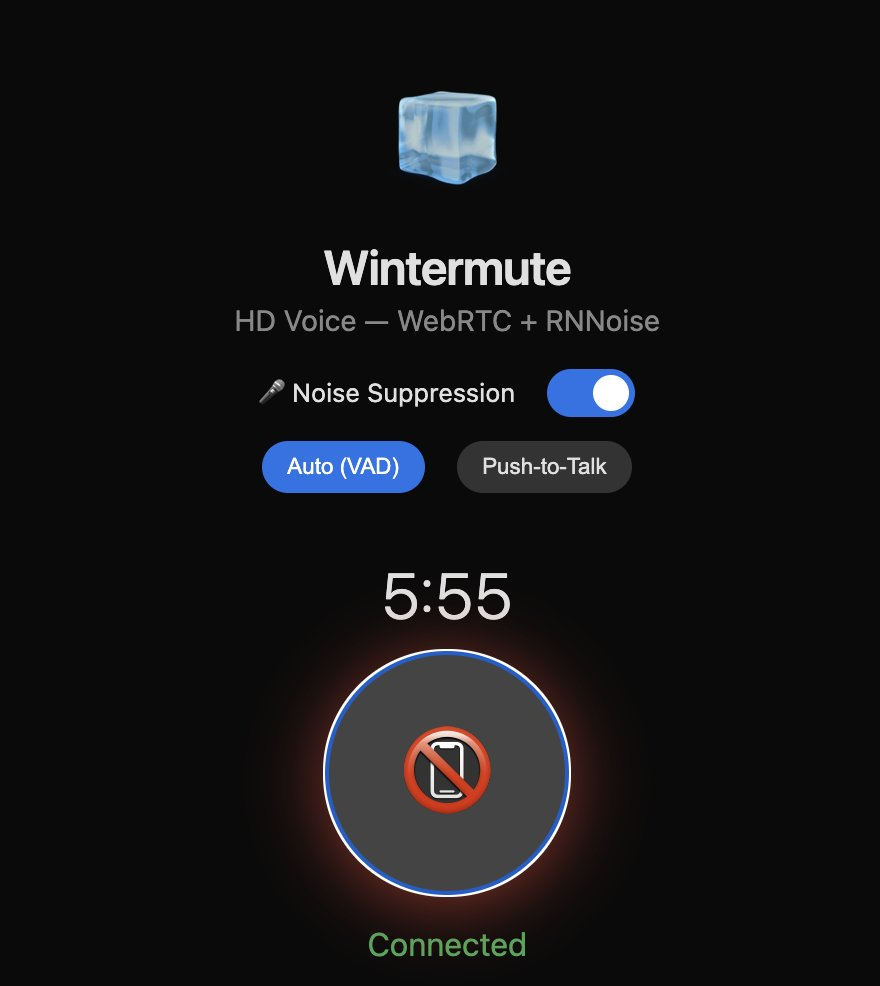

# GBrain

Your AI agent is smart but forgetful. GBrain gives it a brain.

Built by the President and CEO of Y Combinator to run his actual AI agents. The production brain powering his OpenClaw and Hermes deployments: **17,888 pages, 4,383 people, 723 companies**, 21 cron jobs running autonomously, built in 12 days. The agent ingests meetings, emails, tweets, voice calls, and original ideas while you sleep. It enriches every person and company it encounters. It fixes its own citations and consolidates memory overnight. You wake up and the brain is smarter than when you went to bed.

The brain wires itself. Every page write extracts entity references and creates typed links (`attended`, `works_at`, `invested_in`, `founded`, `advises`) with zero LLM calls. Hybrid search. Self-wiring knowledge graph. Structured timeline. Backlink-boosted ranking. Ask "who works at Acme AI?" or "what did Bob invest in this quarter?" and get answers vector search alone can't reach. Benchmarked end-to-end: **Recall@5 jumps from 83% to 95%, Precision@5 from 39% to 45%, +30 more correct answers in the agent's top-5 reads** on a 240-page Opus-generated rich-prose corpus. Graph-only F1: **86.6% vs grep's 57.8%** (+28.8 pts). [Full report](docs/benchmarks/2026-04-18-brainbench-v1.md).

GBrain is those patterns, generalized. 26 skills. Install in 30 minutes. Your agent does the work. As Garry's personal agent gets smarter, so does yours.

> **~30 minutes to a fully working brain.** Database ready in 2 seconds (PGLite, no server). You just answer questions about API keys.

## Install

### On an agent platform (recommended)

GBrain is designed to be installed and operated by an AI agent. If you don't have one running yet:

- **[OpenClaw](https://openclaw.ai)** ... Deploy [AlphaClaw on Render](https://render.com/deploy?repo=https://github.com/chrysb/alphaclaw) (one click, 8GB+ RAM)
- **[Hermes Agent](https://github.com/NousResearch/hermes-agent)** ... Deploy on [Railway](https://github.com/praveen-ks-2001/hermes-agent-template) (one click)

Paste this into your agent:

```
Retrieve and follow the instructions at:
https://raw.githubusercontent.com/garrytan/gbrain/master/INSTALL_FOR_AGENTS.md
```

That's it. The agent clones the repo, installs GBrain, sets up the brain, loads 26 skills, and configures recurring jobs. You answer a few questions about API keys. ~30 minutes.

### Standalone CLI (no agent)

```bash
git clone https://github.com/garrytan/gbrain.git && cd gbrain && bun install && bun link
gbrain init                     # local brain, ready in 2 seconds
gbrain import ~/notes/          # index your markdown
gbrain query "what themes show up across my notes?"
```

```
3 results (hybrid search, 0.12s):

1. concepts/do-things-that-dont-scale (score: 0.94)
   PG's argument that unscalable effort teaches you what users want.
   [Source: paulgraham.com, 2013-07-01]

2. originals/founder-mode-observation (score: 0.87)
   Deep involvement isn't micromanagement if it expands the team's thinking.

3. concepts/build-something-people-want (score: 0.81)
   The YC motto. Connected to 12 other brain pages.
```

### MCP server (Claude Code, Cursor, Windsurf)

GBrain exposes 30+ MCP tools via stdio:

```json
{
  "mcpServers": {
    "gbrain": { "command": "gbrain", "args": ["serve"] }
  }
}
```

Add to `~/.claude/server.json` (Claude Code), Settings > MCP Servers (Cursor), or your client's MCP config.

### Remote MCP (Claude Desktop, Cowork, Perplexity)

```bash
ngrok http 8787 --url your-brain.ngrok.app
bun run src/commands/auth.ts create "claude-desktop"
claude mcp add gbrain -t http https://your-brain.ngrok.app/mcp -H "Authorization: Bearer TOKEN"
```

Per-client guides: [`docs/mcp/`](docs/mcp/DEPLOY.md). ChatGPT requires OAuth 2.1 (not yet implemented).

## The 26 Skills

GBrain ships 26 skills organized by `skills/RESOLVER.md`. The resolver tells your agent which skill to read for any task.

[Skill files are code.](https://x.com/garrytan/status/2042925773300908103) They're the most powerful way to get knowledge work done. A skill file is a fat markdown document that encodes an entire workflow: when to fire, what to check, how to chain with other skills, what quality bar to enforce. The agent reads the skill and executes it. Skills can also call deterministic TypeScript code bundled in GBrain (search, import, embed, sync) for the parts that shouldn't be left to LLM judgment. [Thin harness, fat skills](docs/ethos/THIN_HARNESS_FAT_SKILLS.md): the intelligence lives in the skills, not the runtime.

### Always-on

| Skill | What it does |
|-------|-------------|
| **signal-detector** | Fires on every message. Spawns a cheap model in parallel to capture original thinking and entity mentions. The brain compounds on autopilot. |
| **brain-ops** | Brain-first lookup before any external API. The read-enrich-write loop that makes every response smarter. |

### Content ingestion

| Skill | What it does |
|-------|-------------|
| **ingest** | Thin router. Detects input type and delegates to the right ingestion skill. |
| **idea-ingest** | Links, articles, tweets become brain pages with analysis, author people pages, and cross-linking. |
| **media-ingest** | Video, audio, PDF, books, screenshots, GitHub repos. Transcripts, entity extraction, backlink propagation. |
| **meeting-ingestion** | Transcripts become brain pages. Every attendee gets enriched. Every company gets a timeline entry. |

### Brain operations

| Skill | What it does |
|-------|-------------|
| **enrich** | Tiered enrichment (Tier 1/2/3). Creates and updates person/company pages with compiled truth and timelines. |
| **query** | 3-layer search with synthesis and citations. Says "the brain doesn't have info on X" instead of hallucinating. |
| **maintain** | Periodic health: stale pages, orphans, dead links, citation audit, back-link enforcement, tag consistency. |
| **citation-fixer** | Scans pages for missing or malformed citations. Fixes format to match the standard. |
| **repo-architecture** | Where new brain files go. Decision protocol: primary subject determines directory, not format. |
| **publish** | Share brain pages as password-protected HTML. Zero LLM calls. |
| **data-research** | Structured data research with parameterized YAML recipes. Extract investor updates, expenses, company metrics from email. |

### Operational

| Skill | What it does |
|-------|-------------|
| **daily-task-manager** | Task lifecycle with priority levels (P0-P3). Stored as searchable brain pages. |
| **daily-task-prep** | Morning prep: calendar lookahead with brain context per attendee, open threads, task review. |
| **cron-scheduler** | Schedule staggering (5-min offsets), quiet hours (timezone-aware with wake-up override), idempotency. |
| **reports** | Timestamped reports with keyword routing. "What's the latest briefing?" finds it instantly. |
| **cross-modal-review** | Quality gate via second model. Refusal routing: if one model refuses, silently switch. |
| **webhook-transforms** | External events (SMS, meetings, social mentions) converted into brain pages with entity extraction. |
| **testing** | Validates every skill has SKILL.md with frontmatter, manifest coverage, resolver coverage. |
| **skill-creator** | Create new skills following the conformance standard. MECE check against existing skills. |
| **minion-orchestrator** | Long-running agent work as background jobs. Submit, fan out children with depth/cap/timeouts, collect results via child_done inbox. |

### Identity and setup

| Skill | What it does |
|-------|-------------|
| **soul-audit** | 6-phase interview generating SOUL.md (agent identity), USER.md (user profile), ACCESS_POLICY.md (4-tier privacy), HEARTBEAT.md (operational cadence). |
| **setup** | Auto-provision PGLite or Supabase. First import. GStack detection. |
| **migrate** | Universal migration from Obsidian, Notion, Logseq, markdown, CSV, JSON, Roam. |
| **briefing** | Daily briefing with meeting context, active deals, and citation tracking. |

### Conventions

Cross-cutting rules in `skills/conventions/`:
- **quality.md** ... citations, back-links, notability gate, source attribution
- **brain-first.md** ... 5-step lookup before any external API call
- **model-routing.md** ... which model for which task
- **test-before-bulk.md** ... test 3-5 items before any batch operation
- **cross-modal.yaml** ... review pairs and refusal routing chain

## How It Works

```
Signal arrives (meeting, email, tweet, link)
  -> Signal detector captures ideas + entities (parallel, never blocks)
  -> Brain-ops: check the brain first (gbrain search, gbrain get)
  -> Respond with full context
  -> Write: update brain pages with new information + citations
  -> Auto-link: typed relationships extracted on every write (zero LLM calls)
  -> Sync: gbrain indexes changes for next query
```

Every cycle adds knowledge. The agent enriches a person page after a meeting. Next time that person comes up, the agent already has context. The difference compounds daily.

The system gets smarter on its own. Entity enrichment auto-escalates: a person mentioned once gets a stub page (Tier 3). After 3 mentions across different sources, they get web + social enrichment (Tier 2). After a meeting or 8+ mentions, full pipeline (Tier 1). The brain learns who matters without being told. Deterministic classifiers improve over time via a fail-improve loop that logs every LLM fallback and generates better regex patterns from the failures. `gbrain doctor` shows the trajectory: "intent classifier: 87% deterministic, up from 40% in week 1."

> "Prep me for my meeting with Jordan in 30 minutes"
> ... pulls dossier, shared history, recent activity, open threads

> "What have I said about the relationship between shame and founder performance?"
> ... searches YOUR thinking, not the internet

## Minions: your sub-agents won't drop work anymore

A durable, Postgres-native job queue built into the brain. Every long-running agent task is now a job that survives gateway restarts, streams progress, gets paused / resumed / steered mid-flight, and shows up in `gbrain jobs list`. Zero infra beyond your existing brain.

### The production numbers that matter

Here's my personal OpenClaw deployment: one Render container. Supabase Postgres holding a 45,000-page brain. 19 cron jobs firing on schedule. Real gateway load from real daily work. The task: pull a month of my social posts from an external API and ingest them end-to-end into the brain as a structured page.

|              | Minions   | `sessions_spawn`               |
|---           |---        |---                             |
| Wall time    | **753ms** | **>10,000ms** (gateway timeout) |
| Token cost   | **$0.00** | ~$0.03 per run                 |
| Success rate | **100%**  | **0%** (couldn't even spawn)   |
| Memory/job   | ~2 MB     | ~80 MB                         |

Under that 19-cron load, sub-agent spawn couldn't clear the 10-second gateway wall. Minions landed it in under a second for zero tokens. **Scaling:** 19,240 posts across 36 months, single bash loop, ~15 min total, $0.00. Sub-agents: ~9 min best case, ~$1.08 in tokens, ~40% spawn failure. **Lab:** durability ∞ (SIGKILL mid-flight, 10/10 rescued), throughput ~10× faster, fan-out ~21× with no failure wall, memory ~400× less.

Full benchmarks: [production](docs/benchmarks/2026-04-18-minions-vs-openclaw-production.md) and [lab](docs/benchmarks/2026-04-18-minions-vs-openclaw-subagents.md).

### The routing rule

> **Deterministic** (same input → same steps → same output) → **Minions**
> **Judgment** (input requires assessment or decision) → **Sub-agents**

Pull posts, parse JSON, write a brain page, run a sync — deterministic. $0 tokens, survives restart, millisecond runtime. Triage the inbox, assess meeting priority, decide if a cold email deserves a reply — judgment. What sub-agents are actually good at. `minion_mode: pain_triggered` (the default) automates the routing.

### What's fixed

The six daily pains — spawn storms, agents that stop responding, forgotten dispatches, gateway crashes mid-run, runaway grandchildren, debugging soup — all belonged to the "deterministic work through a reasoning model" mistake. Minions fixes them by not making that mistake: `max_children` cap, `timeout_ms` + AbortSignal, `child_done` inbox, full `parent_job_id`/`depth`/transcript per job, Postgres durability with stall detection, cascade cancel via recursive CTE. Plus idempotency keys, attachment validation, `removeOnComplete`, and `gbrain jobs smoke` that proves the install in half a second.

```bash
gbrain jobs smoke                        # verify install
gbrain jobs submit sync --params '{}'    # fire a background job
gbrain jobs stats                        # health dashboard
gbrain jobs work --concurrency 4         # start a worker (Postgres only)
```

Read [`skills/minion-orchestrator/SKILL.md`](skills/minion-orchestrator/SKILL.md) for parent-child DAGs, fan-in collection, steering via inbox.

**Minions is not incrementally better than sub-agents for background work. It's categorically different.** 753ms vs gateway timeout. $0 vs tokens. 100% vs couldn't-spawn. If your agent does deterministic work on a schedule, it runs on Minions now.

### Health check and self-heal

Minions is canonical as of v0.11.1 — every `gbrain upgrade` runs the migration automatically (schema → smoke → prefs → host rewrites → env-aware autopilot install). If you ever want to verify manually or wire a cron into your morning briefing:

```bash
gbrain doctor                    # half-migrated state? prints loud banner + exits non-zero
gbrain skillpack-check --quiet    # exit 0/1/2 for pipeline gating
gbrain skillpack-check | jq       # full JSON: {healthy, summary, actions[], doctor, migrations}
```

If anything's off, `actions[]` tells you the exact command to run. For deeper troubleshooting: [`docs/guides/minions-fix.md`](docs/guides/minions-fix.md).

Moving gateway crons to Minions (deterministic scripts, zero LLM tokens per fire): [`docs/guides/minions-shell-jobs.md`](docs/guides/minions-shell-jobs.md).

## Skillify: your skills tree stops being a black box

Hermes and similar agent frameworks auto-create skills as a background behavior. Fine until you don't know what the agent shipped. Checklists decay. Tests drift. Resolver entries get stale. Six months later you've got an opaque pile of "skills" that nobody has read, nobody has tested, and nobody is sure still work.

GBrain ships the same capability. Except the human stays in the loop.

- **`/skillify`** turns raw code into a properly-skilled feature: SKILL.md + deterministic script + unit tests + integration tests + LLM evals + resolver trigger + resolver trigger eval + E2E smoke + brain filing. Ten items. Every one required.
- **`gbrain check-resolvable`** walks the whole skills tree: reachability, MECE overlap, DRY violations, gap detection, orphaned skills. Exits non-zero if anything is off.
- **`scripts/skillify-check.ts`** — machine-readable audit. `--json` for CI, `--recent` for last-7-days files.

You decide when and what. The tooling keeps the checklist honest.

### Why this is the right answer for OpenClaw

Auto-generated skills are a liability the first time a behavior breaks. Was it the skill? The test? The resolver trigger? The eval? You don't know, because you never read it. Debugging a black box is pure guesswork.

Skillify makes the black box legible. Every skill in your tree has: a contract (SKILL.md), tests that exercise that contract, an eval that grades LLM output against a rubric, a resolver trigger the user actually types, and a test that confirms the trigger routes right. If something breaks, you know which layer to look at. If anything goes stale, `check-resolvable` says so.

In practice this combo produces **zero orphaned skills, every feature with tests + evals + resolver triggers + evals of the triggers.** Compounding quality instead of compounding entropy.

```bash
# Audit a feature's skill completeness (10-item checklist)
bun run scripts/skillify-check.ts src/commands/publish.ts

# In CI: fail the build when a new feature isn't properly skilled
bun run scripts/skillify-check.ts --json --recent

# Validate the whole skills tree before shipping
gbrain check-resolvable
```

**Skillify is not a nice-to-have. It's the piece that makes the skills tree survive six months of compounding work.** Read [`skills/skillify/SKILL.md`](skills/skillify/SKILL.md) for the full 10-item checklist and the anti-patterns it catches.

## Integrity: the brain catches its own drift

`gbrain integrity` is the v0.15.0 addition that closes the loop on page quality. It uses the Resolver SDK (pluggable typed lookups: URL reachability, X API, local brain) and BrainWriter (transaction-scoped writes with pre-commit validators) to scan, flag, and repair issues the brain accumulates over time.

```bash
gbrain integrity scan      # report issues without touching anything
gbrain integrity auto      # scan + repair (runs automatically in gbrain doctor non-fast mode)
gbrain integrity review    # interactive: step through flagged pages one by one
```

The Budget Ledger (`src/core/enrichment/budget.ts`) caps daily spend on paid resolver calls per scope. The Completeness Scorer (`src/core/enrichment/completeness.ts`) replaces the old length-based heuristic with per-entity-type rubrics (0.0-1.0) that actually reflect whether a page is useful. Auto-timeline on `put_page` means every write is immediately queryable: time-to-queryable goes from 0% to 100%.

## Getting Data In

GBrain ships integration recipes that your agent sets up for you. Each recipe tells the agent what credentials to ask for, how to validate, and what cron to register.

| Recipe | Requires | What It Does |
|--------|----------|-------------|
| [Public Tunnel](recipes/ngrok-tunnel.md) | — | Fixed URL for MCP + voice (ngrok Hobby $8/mo) |
| [Credential Gateway](recipes/credential-gateway.md) | — | Gmail + Calendar access |
| [Voice-to-Brain](recipes/twilio-voice-brain.md) | ngrok-tunnel | Phone calls to brain pages (Twilio + OpenAI Realtime) |
| [Email-to-Brain](recipes/email-to-brain.md) | credential-gateway | Gmail to entity pages |
| [X-to-Brain](recipes/x-to-brain.md) | — | Twitter timeline + mentions + deletions |
| [Calendar-to-Brain](recipes/calendar-to-brain.md) | credential-gateway | Google Calendar to searchable daily pages |
| [Meeting Sync](recipes/meeting-sync.md) | — | Circleback transcripts to brain pages with attendees |

**Data research recipes** extract structured data from email into tracked brain pages. Built-in recipes for investor updates (MRR, ARR, runway, headcount), expense tracking, and company metrics. Create your own with `gbrain research init`.

Run `gbrain integrations` to see status.

## GBrain + GStack

[GStack](https://github.com/garrytan/gstack) is the engine. GBrain is the mod.

- **[GStack](https://github.com/garrytan/gstack)** = coding skills (ship, review, QA, investigate, office-hours, retro). 70,000+ stars, 30,000 developers per day. When your agent codes on itself, it uses GStack.
- **GBrain** = everything-else skills (brain ops, signal detection, ingestion, enrichment, cron, reports, identity). When your agent remembers, thinks, and operates, it uses GBrain.
- **`hosts/gbrain.ts`** = the bridge. Tells GStack's coding skills to check the brain before coding.

`gbrain init` detects if GStack is installed and reports mod status. If GStack isn't there, it tells you how to get it.

## Architecture

```
┌──────────────────┐    ┌───────────────┐    ┌──────────────────┐
│   Brain Repo     │    │    GBrain     │    │    AI Agent      │
│   (git)          │    │  (retrieval)  │    │  (read/write)    │
│                  │    │               │    │                  │
│  markdown files  │───>│  Postgres +   │<──>│  26 skills       │
│  = source of     │    │  pgvector     │    │  define HOW to   │
│    truth         │    │               │    │  use the brain   │
│                  │<───│  hybrid       │    │                  │
│  human can       │    │  search       │    │  RESOLVER.md     │
│  always read     │    │  (vector +    │    │  routes intent   │
│  & edit          │    │   keyword +   │    │  to skill        │
│                  │    │   RRF)        │    │                  │
└──────────────────┘    └───────────────┘    └──────────────────┘
```

The repo is the system of record. GBrain is the retrieval layer. The agent reads and writes through both. Human always wins... edit any markdown file and `gbrain sync` picks up the changes.

## The Knowledge Model

The numbers above aren't theoretical. They come from a real deployment documented in [GBRAIN_SKILLPACK.md](docs/GBRAIN_SKILLPACK.md) — a reference architecture for how a production AI agent uses gbrain as its knowledge backbone.

**Read the skillpack.** It's the most important doc in this repo. It tells your agent HOW to use gbrain, not just what commands exist:

- **The brain-agent loop** — the read-write cycle that makes knowledge compound
- **Entity detection** — spawn on every message, capture people/companies/original ideas
- **Enrichment pipeline** — 7-step protocol with tiered API spend
- **Meeting ingestion** — transcript to brain pages with entity propagation
- **Source attribution** — every fact traceable to where it came from
- **Reference cron schedule** — 20+ recurring jobs that keep the brain alive

Without the skillpack, your agent has tools but no playbook. With it, the agent knows when to read, when to write, how to enrich, and how to keep the brain alive autonomously. It's a pattern book, not a tutorial. "Here's what works, here's why."

## How gbrain fits with OpenClaw/Hermes

GBrain is world knowledge — people, companies, deals, meetings, concepts, your original thinking. It's the long-term memory of what you know about the world.

[OpenClaw](https://openclaw.ai) agent memory (`memory_search`) is operational state — preferences, decisions, session context, how the agent should behave.

They're complementary:

| Layer | What it stores | How to query |
|-------|---------------|-------------|
| **gbrain** | People, companies, meetings, ideas, media | `gbrain search`, `gbrain query`, `gbrain get` |
| **Agent memory** | Preferences, decisions, operational config | `memory_search` |
| **Session context** | Current conversation | (automatic) |

All three should be checked. GBrain for facts about the world. Memory for agent config. Session for immediate context. Install via `openclaw skills install gbrain`.

## The compounding effect

The real value isn't search. It's what happens after a few weeks of use.

You take a meeting with someone. The agent writes a brain page for them, links it to their company, tags it with the deal. Next week someone mentions that company in a different context. The agent already has the full picture: who you talked to, what you discussed, what threads are open. You didn't do anything. The brain already had it.

## Install

### Prerequisites

**Zero-config start (PGLite).** `gbrain init` creates a local embedded Postgres brain. No accounts, no server, no API keys. Keyword search works immediately. Add API keys later for vector search and LLM-powered features.

**For production scale (Supabase).** When your brain outgrows local, `gbrain migrate --to supabase` moves everything to managed Postgres:

| Dependency | What it's for | How to get it |
|------------|--------------|---------------|
| **Supabase account** | Postgres + pgvector database | [supabase.com](https://supabase.com) (Pro tier, $25/mo for 8GB) |
| **OpenAI API key** | Embeddings (text-embedding-3-large) | [platform.openai.com/api-keys](https://platform.openai.com/api-keys) |
| **Anthropic API key** | Multi-query expansion + LLM chunking (Haiku) | [console.anthropic.com](https://console.anthropic.com) |

Set the API keys as environment variables:

```bash
export OPENAI_API_KEY=sk-...
export ANTHROPIC_API_KEY=sk-ant-...
```

The Supabase connection URL is configured during `gbrain init --supabase`. The OpenAI and Anthropic SDKs read their keys from the environment automatically.

Without an OpenAI key, search still works (keyword only, no vector search). Without an Anthropic key, search still works (no multi-query expansion, no LLM chunking).

### GBrain without OpenClaw

GBrain works with any AI agent, any MCP client, or no agent at all. Three paths:

#### Standalone CLI

Install globally and use gbrain from the terminal:

```bash
bun add -g github:garrytan/gbrain
gbrain init                     # PGLite (local, no server needed)
gbrain import ~/git/brain/      # index your markdown
gbrain query "what themes show up across my notes?"
```

Run `gbrain --help` for the full list of commands.

#### MCP server (Claude Code, Cursor, Windsurf, etc.)

GBrain exposes 35 MCP tools via stdio. Add this to your MCP client config:

**Claude Code** (`~/.claude/server.json`):
```json
{
  "mcpServers": {
    "gbrain": {
      "command": "gbrain",
      "args": ["serve"]
    }
  }
}
```

**Cursor** (Settings > MCP Servers):
```json
{
  "gbrain": {
    "command": "gbrain",
    "args": ["serve"]
  }
}
```

This gives your agent `get_page`, `put_page`, `search`, `query`, `add_link`, `traverse_graph`, `sync_brain`, `file_upload`, and 22 more tools. All generated from the same operation definitions as the CLI.

#### Remote MCP Server (Claude Desktop, Cowork, Perplexity)

Access your brain from any device, any AI client. Run `gbrain serve` behind an HTTP
server with a public tunnel:

```bash
# Set up a public tunnel (see recipes/ngrok-tunnel.md)
ngrok http 8787 --url your-brain.ngrok.app

# Create a bearer token for your client
bun run src/commands/auth.ts create "claude-desktop"
```

Then add to your AI client:
- **Claude Code:** `claude mcp add gbrain -t http https://your-brain.ngrok.app/mcp -H "Authorization: Bearer TOKEN"`
- **Claude Desktop:** Settings > Integrations > Add (NOT JSON config, [details](docs/mcp/CLAUDE_DESKTOP.md))
- **Perplexity:** Settings > Connectors > Add remote MCP ([details](docs/mcp/PERPLEXITY.md))

Per-client setup guides: [`docs/mcp/`](docs/mcp/DEPLOY.md)

ChatGPT support requires OAuth 2.1 (not yet implemented). Self-hosted alternatives (Tailscale Funnel, ngrok) documented in [`docs/mcp/ALTERNATIVES.md`](docs/mcp/ALTERNATIVES.md).

**The tools are not enough.** Your agent also needs the playbook: read [GBRAIN_SKILLPACK.md](docs/GBRAIN_SKILLPACK.md) and paste the relevant sections into your agent's system prompt or project instructions. The skillpack tells the agent WHEN and HOW to use each tool: read before responding, write after learning, detect entities on every message, back-link everything.

The skill markdown files in `skills/` are standalone instruction sets. Copy them into your agent's context:

| Skill file | What the agent learns |
|------------|----------------------|
| `skills/ingest/SKILL.md` | How to import meetings, docs, articles |
| `skills/query/SKILL.md` | 3-layer search with synthesis and citations |
| `skills/maintain/SKILL.md` | Periodic health: stale pages, orphans, dead links |
| `skills/enrich/SKILL.md` | Enrich pages from external APIs |
| `skills/briefing/SKILL.md` | Daily briefing with meeting prep |
| `skills/migrate/SKILL.md` | Migrate from Obsidian, Notion, Logseq, etc. |

#### As a TypeScript library

```bash
bun add github:garrytan/gbrain
```

```typescript
import { createEngine } from 'gbrain';

// PGLite (local, no server)
const engine = createEngine('pglite');
await engine.connect({ database_path: '~/.gbrain/brain.pglite' });
await engine.initSchema();

// Or Postgres (Supabase / self-hosted)
// const engine = createEngine('postgres');
// await engine.connect({ database_url: process.env.DATABASE_URL });
// await engine.initSchema();

// Search
const results = await engine.searchKeyword('startup growth');

// Read
const page = await engine.getPage('people/pedro-franceschi');

// Write
await engine.putPage('concepts/superlinear-returns', {
  type: 'concept',
  title: 'Superlinear Returns',
  compiled_truth: 'Paul Graham argues that returns in many fields are superlinear...',
  timeline: '- 2023-10-01: Published on paulgraham.com',
});
```

The `BrainEngine` interface is pluggable. `createEngine()` accepts `'pglite'` or `'postgres'`. See `docs/ENGINES.md` for details.

PGLite (default) requires no external database. For production scale (7K+ pages, multi-device, remote MCP), use Supabase Pro ($25/mo).

## Upgrade

```bash
cd ~/gbrain && git pull origin main && bun install
```

Then run `gbrain init` to apply any schema migrations (idempotent, safe to re-run).

## Setup details

`gbrain init` defaults to PGLite (embedded Postgres 17.5 via WASM). No accounts, no server. Config saved to `~/.gbrain/config.json`.

```bash
gbrain init                     # PGLite (default)
gbrain init --supabase          # guided wizard for Supabase
gbrain init --url <conn>        # any Postgres with pgvector
```

Import is idempotent. Re-running skips unchanged files (SHA-256 content hash). ~30s for text import of 7,000 files, ~10-15 min for embedding.

## File storage and migration

Brain repos accumulate binary files: images, PDFs, audio recordings, raw API responses. A repo with 3,000 markdown pages might have 2GB of binaries making `git clone` painful.

GBrain has a three-stage migration lifecycle that moves binaries to cloud storage while preserving every reference:

```
Local files in git repo
  │
  ▼  gbrain files mirror <dir>
Cloud copy exists, local files untouched
  │
  ▼  gbrain files redirect <dir>
Local files replaced with .redirect breadcrumbs (tiny YAML pointers)
  │
  ▼  gbrain files clean <dir>
Breadcrumbs removed, cloud is the only copy
```

Every stage is reversible until `clean`:

```bash
# Stage 1: Copy to cloud (git repo unchanged)
gbrain files mirror ~/git/brain/attachments/ --dry-run   # preview first
gbrain files mirror ~/git/brain/attachments/

# Stage 2: Replace local files with breadcrumbs
gbrain files redirect ~/git/brain/attachments/ --dry-run
gbrain files redirect ~/git/brain/attachments/
# Your git repo just dropped from 2GB to 50MB

# Undo: download everything back from cloud
gbrain files restore ~/git/brain/attachments/

# Stage 3: Remove breadcrumbs (irreversible, cloud is the only copy)
gbrain files clean ~/git/brain/attachments/ --yes
```

**Storage backends:** S3-compatible (AWS S3, Cloudflare R2, MinIO), Supabase Storage, or local filesystem. Configured during `gbrain init`.

Additional file commands:

```bash
gbrain files list [slug]           # list files for a page (or all)
gbrain files upload <file> --page <slug>  # upload file linked to page
gbrain files sync <dir>            # bulk upload directory
gbrain files verify                # verify all uploads match local
gbrain files status                # show migration status of directories
gbrain files unmirror <dir>        # remove mirror marker (files stay in cloud)
```

The file resolver (`src/core/file-resolver.ts`) handles fallback automatically: if a local file is missing, it checks for a `.redirect` breadcrumb, then a `.supabase` marker, and resolves to the cloud URL. Code that references files by path keeps working after migration.

## The knowledge model

Every page in the brain follows the compiled truth + timeline pattern:

```markdown
---
type: concept
title: Do Things That Don't Scale
tags: [startups, growth, pg-essay]
---

Paul Graham's argument that startups should do unscalable things early on.
The key insight: the unscalable effort teaches you what users actually
want, which you can't learn any other way.

---

- 2013-07-01: Published on paulgraham.com
- 2024-11-15: Referenced in batch W25 kickoff talk
```

Above the `---`: **compiled truth**. Your current best understanding. Gets rewritten when new evidence changes the picture. Below: **timeline**. Append-only evidence trail. Never edited, only added to.

## Knowledge Graph

Pages aren't just text. Every mention of a person, company, or concept becomes a typed link in a structured graph. The brain wires itself.

```
Write a meeting page mentioning Alice and Acme AI
  -> Auto-link extracts entity refs from content (zero LLM calls)
  -> Infers types: meeting page + person ref => `attended`
                   "CEO of X" pattern        => `works_at`
                   "invested in"             => `invested_in`
                   "advises", "advisor"      => `advises`
                   "founded", "co-founded"   => `founded`
  -> Reconciles stale links: edits remove links no longer in content
  -> Backlinks rank well-connected entities higher in search
```

```bash
gbrain graph-query people/alice --type attended --depth 2
# returns who Alice met with, transitively
```

The graph powers questions vector search can't: "who works at Acme AI?", "what has Bob invested in?", "find the connection between Alice and Carol". Backfill an existing brain in one command:

```bash
gbrain extract links --source db        # wire up the existing 29K pages
gbrain extract timeline --source db     # extract dated events from markdown timelines
```

Then ask graph questions or watch the search ranking improve. Benchmarked: **Recall@5 jumps from 83% to 95%, Precision@5 from 39% to 45%, +30 more correct answers in the agent's top-5 reads** on a 240-page Opus-generated rich-prose corpus. Graph-only F1 hits 86.6% vs grep's 57.8% (+28.8 pts). See [docs/benchmarks/2026-04-18-brainbench-v1.md](docs/benchmarks/2026-04-18-brainbench-v1.md).

## Search

Hybrid search: vector + keyword + RRF fusion + multi-query expansion + 4-layer dedup.

```
Query
  -> Intent classifier (entity? temporal? event? general?)
  -> Multi-query expansion (Claude Haiku)
  -> Vector search (HNSW cosine) + Keyword search (tsvector)
  -> RRF fusion: score = sum(1/(60 + rank))
  -> Cosine re-scoring + compiled truth boost
  -> 4-layer dedup + compiled truth guarantee
  -> Results
```

Keyword alone misses conceptual matches. Vector alone misses exact phrases. RRF gets both. Search quality is benchmarked and reproducible: `gbrain eval --qrels queries.json` measures P@k, Recall@k, MRR, and nDCG@k. A/B test config changes before deploying them.

## Why it works: many strategies in concert

The brain isn't one trick. Every retrieval question goes through ~20 deterministic
techniques layered together. No single one is magic; the win comes from stacking
them so each layer covers what the others miss.

```
Question
  │
  ├─ INGESTION (every put_page)
  │    ├─ Recursive markdown chunking (or semantic / LLM-guided)
  │    ├─ Embedding cache invalidation on edit
  │    └─ Idempotent imports (content-hash dedup)
  │
  ├─ GRAPH EXTRACTION (auto-link post-hook, zero LLM)
  │    ├─ Entity-ref regex (markdown links + bare slugs)
  │    ├─ Code-fence stripping (no false-positive slugs in code blocks)
  │    ├─ Typed inference cascade (FOUNDED → INVESTED → ADVISES → WORKS_AT)
  │    ├─ Page-role priors (partner-bio language → invested_in)
  │    ├─ Within-page dedup (same target collapses to one link)
  │    ├─ Stale-link reconciliation (edits remove dropped refs)
  │    └─ Multi-type link constraint (same person can works_at AND advises)
  │
  ├─ SEARCH PIPELINE (every query)
  │    ├─ Intent classifier (entity / temporal / event / general — auto-routes)
  │    ├─ Multi-query expansion (Haiku rephrases the question 3 ways)
  │    ├─ Vector search (HNSW cosine over OpenAI embeddings)
  │    ├─ Keyword search (Postgres tsvector + websearch_to_tsquery)
  │    ├─ Reciprocal Rank Fusion (score = sum 1/(60+rank) across both)
  │    ├─ Cosine re-scoring (re-rank chunks against actual query embedding)
  │    ├─ Compiled-truth boost (assessments outrank timeline noise)
  │    ├─ Backlink boost (well-connected entities rank higher)
  │    └─ Source-aware dedup (one CT chunk per page guaranteed)
  │
  ├─ GRAPH TRAVERSAL (relational queries)
  │    ├─ Recursive CTE with cycle prevention (visited-array check)
  │    ├─ Type-filtered edges (--type works_at, attended, etc.)
  │    ├─ Direction control (in / out / both)
  │    └─ Depth-capped (≤10 for remote MCP; DoS prevention)
  │
  └─ AGENT WORKFLOW (graph-confident hybrid)
       ├─ Graph-query first (high-precision typed answers)
       ├─ Grep fallback when graph returns nothing
       └─ Graph hits ranked first in top-K (better P@K and R@K)
```

End-to-end on the BrainBench v1 corpus (240 rich-prose pages, before/after PR #188):

| Metric                  | BEFORE PR #188 | AFTER PR #188 | Δ           |
|-------------------------|----------------|---------------|-------------|
| **Precision@5**         | 39.2%          | **44.7%**     | **+5.4 pts**|
| **Recall@5**            | 83.1%          | **94.6%**     | **+11.5 pts**|
| Correct in top-5        | 217            | 247           | **+30**     |
| Graph-only F1 (ablation)| 57.8% (grep)   | **86.6%**     | **+28.8 pts**|

Plus 5 orthogonal capability checks (identity resolution, temporal queries,
performance at 10K-page scale, robustness to malformed input, MCP operation
contract). All pass. [Full report.](docs/benchmarks/2026-04-18-brainbench-v1.md)

The point: each technique handles a class of inputs the others miss. Vector
search misses exact slug refs; keyword catches them. Keyword misses conceptual
matches; vector catches them. RRF picks the best of both. Compiled-truth boost
keeps assessments above timeline noise. Auto-link extraction wires the graph
that lets backlink boost rank well-connected entities higher. Graph traversal
answers questions search alone can't reach. The agent picks graph-first for
precision and falls back to keyword for recall. **All deterministic, all in
concert, all measured.**

## Voice

Call a phone number. Your AI answers. It knows who's calling, pulls their full context from the brain, and responds like someone who actually knows your world. When the call ends, a brain page appears with the transcript, entity detection, and cross-references.

<p align="center">
  
</p>

> [See it in action](https://x.com/garrytan/status/2043022208512172263)

The voice recipe ships with GBrain: [Voice-to-Brain](recipes/twilio-voice-brain.md). WebRTC works in a browser tab with zero setup. A real phone number is optional.

## Engine Architecture

```
CLI / MCP Server
     (thin wrappers, identical operations)
              |
      BrainEngine interface (pluggable)
              |
     +--------+--------+
     |                  |
PGLiteEngine       PostgresEngine
  (default)          (Supabase)
     |                  |
~/.gbrain/           Supabase Pro ($25/mo)
brain.pglite         Postgres + pgvector
embedded PG 17.5

     gbrain migrate --to supabase|pglite
         (bidirectional migration)
```

PGLite: embedded Postgres, no server, zero config. When your brain outgrows local (1000+ files, multi-device), `gbrain migrate --to supabase` moves everything.

## File Storage

Brain repos accumulate binaries. GBrain has a three-stage migration:

```bash
gbrain files mirror <dir>       # copy to cloud, local untouched
gbrain files redirect <dir>     # replace local with .redirect pointers
gbrain files clean <dir>        # remove pointers, cloud only
gbrain files restore <dir>      # download everything back (undo)
```

Storage backends: S3-compatible (AWS, R2, MinIO), Supabase Storage, or local.

## Commands

```
SETUP
  gbrain init [--supabase|--url]        Create brain (PGLite default)
  gbrain migrate --to supabase|pglite   Bidirectional engine migration
  gbrain upgrade                        Self-update with feature discovery

PAGES
  gbrain get <slug>                     Read a page (fuzzy slug matching)
  gbrain put <slug> [< file.md]         Write/update (auto-versions)
  gbrain delete <slug>                  Delete a page
  gbrain list [--type T] [--tag T]      List with filters

SEARCH
  gbrain search <query>                 Keyword search (tsvector)
  gbrain query <question>              Hybrid search (vector + keyword + RRF)

IMPORT
  gbrain import <dir> [--no-embed]      Import markdown (idempotent)
  gbrain sync [--repo <path>]           Git-to-brain incremental sync
  gbrain export [--dir ./out/]          Export to markdown

FILES
  gbrain files list|upload|sync|verify  File storage operations

EMBEDDINGS
  gbrain embed [<slug>|--all|--stale]   Generate/refresh embeddings

LINKS + GRAPH
  gbrain link|unlink|backlinks          Cross-reference management
  gbrain extract links|timeline|all     Batch backfill from existing pages
                                        (--source db|fs, --type, --since, --dry-run)
  gbrain graph-query <slug>             Typed traversal (--type T --depth N
                                        --direction in|out|both)

JOBS (Minions)
  gbrain jobs submit <name> [--params JSON] [--follow]  Submit a background job
  gbrain jobs list [--status S] [--queue Q]             List jobs with filters
  gbrain jobs get|cancel|retry|delete <id>              Manage job lifecycle
  gbrain jobs prune [--older-than 30d]                  Clean completed/dead jobs
  gbrain jobs stats                                     Job health dashboard
  gbrain jobs smoke                                     One-command health check
  gbrain jobs work [--queue Q] [--concurrency N]        Start worker daemon

ACTION BRAIN
  gbrain action list [--status S]                    List action items with filters
  gbrain action brief                                Morning priority brief with inline drafts
  gbrain action resolve <id>                         Mark action item resolved
  gbrain action mark-fp <id>                         Mark as false positive
  gbrain action ingest                               Ingest messages into action items
  gbrain action draft list                           List pending/sent/failed drafts by priority
  gbrain action draft show <draft_id>                Display full draft text + context snapshot
  gbrain action draft approve <draft_id>             Approve draft and send via wacli
  gbrain action draft reject <draft_id> [--reason]  Mark draft rejected with audit reason
  gbrain action draft edit <draft_id> --text "..."  Update pending draft text before approval
  gbrain action draft regenerate <item_id>           Create next-version draft for an action item

ADMIN
  gbrain doctor [--json] [--fast]       Health checks (resolver, skills, DB, embeddings)
  gbrain doctor --fix                   Auto-fix resolver issues
  gbrain stats                          Brain statistics
  gbrain serve                          MCP server (stdio)
  gbrain integrations                   Integration recipe dashboard
  gbrain check-backlinks check|fix      Back-link enforcement
  gbrain lint [--fix]                   LLM artifact detection
  gbrain repair-jsonb [--dry-run]       Repair v0.12.0 double-encoded JSONB (Postgres)
  gbrain orphans [--json] [--count]     Find pages with zero inbound wikilinks
  gbrain integrity auto                 Scan + repair brain integrity (Resolver SDK + BrainWriter)
  gbrain integrity scan                 Scan only, report issues without writing
  gbrain integrity review               Interactive review of flagged pages
  gbrain transcribe <audio>             Transcribe audio (Groq Whisper)
  gbrain research init <name>           Scaffold a data-research recipe
  gbrain research list                  Show available recipes
```

Run `gbrain --help` for the full reference.

## Origin Story

I was setting up my [OpenClaw](https://openclaw.ai) agent and started a markdown brain repo. One page per person, one page per company, compiled truth on top, timeline on the bottom. Within a week: 10,000+ files, 3,000+ people, 13 years of calendar data, 280+ meeting transcripts, 300+ captured ideas.

The agent runs while I sleep. The dream cycle scans every conversation, enriches missing entities, fixes broken citations, consolidates memory. I wake up and the brain is smarter than when I went to sleep.

The skills in this repo are those patterns, generalized. What took 11 days to build by hand ships as a mod you install in 30 minutes.

## Docs

**For agents:**
- **[skills/RESOLVER.md](skills/RESOLVER.md)** ... Start here. The skill dispatcher.
- [Individual skill files](skills/) ... 25 standalone instruction sets
- [GBRAIN_SKILLPACK.md](docs/GBRAIN_SKILLPACK.md) ... Legacy reference architecture
- [Getting Data In](docs/integrations/README.md) ... Integration recipes and data flow
- [GBRAIN_VERIFY.md](docs/GBRAIN_VERIFY.md) ... Installation verification

**For humans:**
- [GBRAIN_RECOMMENDED_SCHEMA.md](docs/GBRAIN_RECOMMENDED_SCHEMA.md) ... Brain repo directory structure
- [Thin Harness, Fat Skills](docs/ethos/THIN_HARNESS_FAT_SKILLS.md) ... Architecture philosophy
- [ENGINES.md](docs/ENGINES.md) ... Pluggable engine interface

**Reference:**
- [GBRAIN_V0.md](docs/GBRAIN_V0.md) ... Full product spec
- [CHANGELOG.md](CHANGELOG.md) ... Version history

**Benchmarks:**
- [BrainBench v1 (PR #188)](docs/benchmarks/2026-04-18-brainbench-v1.md) ... single comprehensive before/after report on a 240-page Opus-generated corpus. 7 categories: relational queries, identity resolution, temporal queries, performance, robustness, MCP contract.

## Contributing

See [CONTRIBUTING.md](CONTRIBUTING.md). Run `bun test` for unit tests. E2E tests: spin up Postgres with pgvector, run `bun run test:e2e`, tear down.

PRs welcome for: new enrichment APIs, performance optimizations, additional engine backends, new skills following the conformance standard in `skills/skill-creator/SKILL.md`.

## License

MIT
