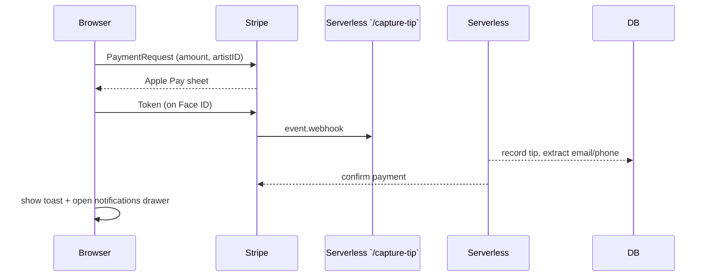

**Topic:** [[chatgpt-knowledge/_topics/business-jovie]]

# Jovi sign-up ideas

> **Source:** ChatGPT conversation
> **Date:** 2025-08-03T04:43:24Z
> **Messages:** 14
> **Topic:** business-jovie

## Question

I'd like you to help me brainstorm some ideas about how we can make this a little more magic, the experience of signing up for Jovi. So, you sign in with, or you search for your artist from Spotify. And when you do that, we're then auto-populating that with an artist profile photo and an artist name and all that stuff. And then we have the listen button, and we're putting in an artist profile link for Spotify. It would be nice if we could magically pull in some other stuff. If there was a way that we could pull in, say, their Apple Music profile, or their SoundCloud profile, other music networks, if we could pull in their social handles and stuff automatically. Now, the source of truth for that would be Spotify pages, which I guess we could go and do, and scrape the Spotify page to see if we can get the URLs, because it's not available through the ABI. But I'm thinking, what else we could do? We could theoretically go to ChartMetric, which would give us the ability to quickly pull in a

## Answer

Alright, Mr. White — if we want Jovi sign-up to feel “magic” and not just “fill out your profile,” we need to think in **layers of enrichment** so that the moment someone picks their Spotify artist name, it looks like we’ve already done 90% of the work for them.  

Here’s a brainstorm in escalating levels of “wow factor,” grouped by how we might implement:  

---

## **1. Core Auto-Fill from Spotify** (instant gratification)
- **Pull existing artist metadata** from the Spotify API:  
  - Name, profile photo, genres, popularity score.  
  - Top track preview for the “Listen” button.  
- **Background color / theme auto-match** from the profile photo for a branded feel (like Spotify Canvas visuals).  
- **Pull followers & monthly listener counts** for social proof.

---

## **2. Scraping & Cross-Linking Profiles**
- **Scrape public Spotify artist pages** (like you said) for outbound links in the “About” section.  
  - Many have links to Instagram, Twitter, Facebook, official websites.  
- **Use MusicBrainz API** to find matching artist records via name + Spotify ID:  
  - Returns a bunch of “relationships” including other music platform IDs, Wikipedia links, etc.  
- **Use Discogs API** for matching artist names + links to label pages, discography, and alternate spellings.  

---

## **3. Chartmetric / Viberate / Third-Party Aggregators**
- **Chartmetric API** (paid) → given a Spotify ID, instantly get:  
  - All social handles (Instagram, TikTok, YouTube, Twitter, Facebook).  
  - All music platform profiles (Apple Music, SoundCloud, Deezer, etc.).  
  - Engagement metrics, audience demographics (nice for dashboard upsells later).  
- **Viberate** works similarly but might be cheaper.

---

## **4. Social Handle Auto-Discovery**
For new artists without an aggregator record:
- **Search Google/Bing API** for `"Artist Name" site:instagram.com` and similar queries.  
- Use fuzzy matching to find likely official profiles.  
- Bonus: Ask them “Is this you?” so they can confirm or skip.  

---

## **5. Visual Magic**
- Auto-generate a **Jovi-styled hero banner** from their profile photo and colors.  
- If they have Spotify Canvas videos, **grab the frames** and animate them subtly on their profile page.  
- Auto-generate a matching **favicon + share preview image** so the link feels finished the second they sign up.

---

## **6. Smart Defaults**
- If no official links are found, suggest **placeholders** with inline edit:
  - “We didn’t find your Instagram — tap here to add it.”  
- Guess their Apple Music URL by slugifying their artist name and testing known Apple Music URL patterns.  
- Same for SoundCloud & YouTube Music.

---

## **7. Extra Magic for Established Artists**
- Pull their **Wikipedia intro** if available and drop it into the bio box.  
- Grab their **latest tour dates** from Songkick/Bandsintown API and offer a “Tour Dates” link block.  
- Auto-generate a “Listen Everywhere” section pulling all their DSPs at once.

---

## **8. Gamified O

*(Answer truncated — 3954 chars total)*

## Question

I'm also considering, um, would be, an idea is, um, on the actual profile, if there's like a, a little notification bell, and it says, um, something along the lines of like, you know, turn on notifications or something, and they turn them, and then they click it, and it opens up a drawer, with an input for your phone number, and then there's like a little toggle to switch to email, you can switch to email, and then they can either put in their phone number or their email, to get notified of, um, you know, when, when that artist puts out something new, and then like, that feature becomes like, global notifications, right, so they can notify people, you know, not just within any specific network, but meet them where they're at. Yeah. I'm just wondering if there's like a layout where we can have like... We want to keep the profile incredibly clean and like our whole dynamic is that... You know, we're... We're not allowing people to customize their profiles because we want them to convert.

## Answer

Got it, Mr. White. Here’s a tight, conversion‑first design that keeps profiles uniform and “Listen” primary, while adding magical, one‑tap notifications.

---

## Product principles
- **Primary CTA stays “Listen.”** Notifications are secondary and quiet.
- **Progressive disclosure.** Nothing new appears until the user asks.
- **One‑tap after first verify.** The “magic” is zero friction on every artist after the first.

---

## UI pattern (minimal + consistent)
**Placement:** A bell icon (secondary style) on the right of the header, opposite the Listen button.  
**Behavior:** Click → bottom sheet/drawer.

**Drawer layout (simple)**
1. Title: **Get updates from {Artist}**
2. Tabs: **Text** | **Email** (Text default)
3. Input:  
   - **Phone** with country picker; masked as `(***) ***‑1234` after capture  
   - **Email** masked as `t***@g***.com` after capture  
4. Microcopy (1 line): “You’ll use this for any artist on Jovie. Reply STOP to unsubscribe.”  
5. CTA: **Turn on notifications** (disabled until valid input)  
6. Legal subtext (8pt): “By subscribing, you agree to receive automated updates. Msg/data rates may apply. STOP to opt out. Terms • Privacy”

---

## First‑time flow (friction where needed)
1. User opens bell → chooses Text (default) or Email → enters contact.  
2. **Verify:**  
   - SMS: 6‑digit OTP; Email: one‑click magic link (or code).  
3. On success:  
   - Toast: “You’ll get updates from {Artist}. You can manage this anytime.”  
   - Drawer shows **Subscribed** state with a per‑artist toggle.

**Copy options (test)**
- “Be first when new music drops.”  
- “Text me when {Artist} releases.”  
- “Get drop alerts.”

---

## Returning flow (the magic)
- Store a **pseudonymous token** in `localStorage` (e.g., `jovie_contact_token`), issued after verify.  
- On any artist profile:  
  - Bell shows **Following** if subscribed; otherwise shows **“Turn on (••••1234)”** one‑tap CTA.  
  - Drawer opens showing masked contact pre‑filled + big **Turn on** button (no re‑entry).  
- If `localStorage` absent (new device): fall back to input + verify.

---

## Global vs per‑artist logic
- **Per‑artist toggle** in the drawer.  
- **Manage all** link (tiny) opens a lightweight preference panel:  
  - Contact: phone/email (masked)  
  - Toggles for categories (New release, Video, Tour, Merch)  
  - Global opt‑out  
- Keep this panel off-profile (route: `/manage`) to avoid clutter.

---

## Data model (lean)
- **ContactMethod**: `{ type: 'sms'|'email', value_hash, verified_at }`
- **VisitorToken** (server‑issued, stored in localStorage): ties browser to ContactMethod.
- **Subscription**: `{ artist_id, contact_id, channel, categories[], created_at, status }`

Security: hash contact at rest; encrypt PII; never render full contact—only last 2–4 digits/chars.

---

## Delivery + compliance (non‑negotiable)
- **Double opt‑in** (OTP/magic link).  
- **TCPA/CAN‑SPAM/GDPR**: clear consent text; age gate if needed; STOP/UNSUB works; audit log of consent.  
-

*(Answer truncated — 4891 chars total)*

## Question

Compose a MarkDoc document for me that I'm going to place in the repo for future features. Describe this in detail so that in that folder I will place this whole description and I want it outlined the way you see it. Once you've done it, I'll just place that in there and then we can give that MarkDoc document to AI later to have it start building out this feature. There we go. There we go.

## Answer

Got it, Mr. White — here’s the **MarkDoc** version for your repo’s `future-features/` folder.  
This is structured for clarity so that when you or an AI dev picks it up later, it’s implementation-ready.  

---

```markdown
# Jovi Feature Spec: Universal Artist Notifications

## Summary
This feature allows visitors to any Jovi artist profile to subscribe for notifications (SMS or Email) when that artist releases new content. After a one-time verification, visitors can follow multiple artists without re-entering their contact details. The system should feel “magical,” frictionless, and fully consistent with Jovi’s clean, conversion-focused design.

---

## Goals
- Enable visitors to opt-in to artist notifications directly from an artist’s Jovi profile.
- Keep profiles visually consistent and conversion-optimized (primary CTA remains **Listen**).
- Provide a “one-tap” subscribe experience after first verification.
- Support both SMS and Email delivery channels.
- Store minimal, secure user data; comply with all relevant laws (TCPA, CAN-SPAM, GDPR).
- Create a global subscription system tied to a pseudonymous browser token, not a full user account.

---

## UI/UX Overview

### Entry Point
- **Bell icon** on profile header (secondary CTA, outline style).
- Icon sits opposite the Listen button.
- Clicking the bell opens a **bottom sheet / drawer**.

### Drawer Layout
1. **Title:** `Get updates from {Artist}`
2. **Tabs:** `Text` | `Email` (default: Text)
3. **Input Field:**
   - Phone: country picker + phone field
   - Email: email field
   - After capture, display masked: `(***) ***-1234` or `t***@g***.com`
4. **Microcopy:** “You’ll use this for any artist on Jovi. Reply STOP to unsubscribe.”
5. **CTA:** `Turn on notifications` (disabled until valid input)
6. **Legal Subtext:** “By subscribing, you agree to receive automated updates. Msg/data rates may apply. STOP to opt out. Terms • Privacy”

---

## User Flows

### First-Time Subscription
1. User clicks bell → Drawer opens.
2. Chooses Text or Email → enters contact info.
3. **Verification:**
   - SMS: 6-digit OTP
   - Email: magic link or code
4. On success:
   - Toast: “You’ll get updates from {Artist}.”
   - Drawer now shows subscribed state + per-artist toggle.

### Returning Visitor
- A pseudonymous token (`visitor_token`) stored in `localStorage` links the browser to their verified contact.
- On any artist profile:
  - Bell shows “Following” if subscribed.
  - Drawer pre-fills masked contact with **Turn on notifications** one-tap option.
- If `localStorage` is missing (new device), revert to first-time flow.

---

## Data Model

### ContactMethod
```json
{
  "id": "uuid",
  "type": "sms" | "email",
  "value_hash": "sha256(contact)",
  "verified_at": "timestamp"
}
```

### VisitorToken
```json
{
  "id": "uuid",
  "contact_id": "uuid",
  "token": "secure_random_string",
  "created_at": "timestamp"
}
```

### Subscription
```json
{
  "id": "uuid",
  "artist_id": "string|spotify_id",
  "contact_id":

*(Answer truncated — 5678 chars total)*

## Question

That's great. So now you kind of get the idea of where we're trying to go with this product, and how we're trying to, like, basically be a new generation of Link and Bio products that actually, like, really serves a purpose in helping artists out and helping them grow a fanbase and make more money, whereas a lot of the Link and Bio products just seem to be clones of LinkTree, which, like, is really kind of a crappy product if you think about it. Everyone's LinkTree looks completely different, and you can even put your Instagram link in, like, one of ten different places, so every time you hit a LinkTree, it's completely different, and they're not efficient, and every link can have a different design, the whole page can have a different design, like, within a single LinkTree, you can have five different designs for links. There's, you know, scrolling like crazy, there's, you know, glittery backgrounds, it feels like MySpace, it just doesn't convert, whereas, you know, we're trying to bu

## Answer

**Next-Gen Jovi Features — High-Impact Ideas That Print Money for Artists**

| # | Feature | Why It Prints Money / Grows Fans | Implementation Sketch (lean MVP) | Differentiator vs. “LinkTree clones” |
|---|---------|---------------------------------|-----------------------------------|--------------------------------------|
| 1 | **Smart Merch Drop Block** | One-click buy inside the profile (fewer hops = higher AOV). Limited-edition countdown drives urgency. | Shopify + Printful webhook → auto-inject “Drop” CTA when inventory > 0. Real-time inventory badge (“12 left”). | LinkTree can only point *away*; Jovi converts **in-place**. |
| 2 | **Dynamic Pre-Save / Pre-Order Aggregator** | Locks in streams before release; boosts day-one charting. | Poll DSP APIs (Spotify, Apple, Deezer) daily. If artist has an unreleased UPC, auto-render “Pre-Save everywhere” banner with one tap. | Fully automatic; no manual setup. |
| 3 | **Geo-Aware Tour Alert** | Sells tickets to the *right* fans, not random global push. | On profile load, IP → city. If artist has Songkick/Bandsintown date within 150 km, surface “See you in {City} – Tickets” ribbon. | Real-time, location-aware. |
| 4 | **Tip-Jar / Micro-Patron** | Direct artist revenue when no merch is ready. Fans love $2 “buy a coffee.” | Stripe Link + Apple Pay; single amount or quick presets ($2, $5, $10). | Frictionless; no Patreon account needed. |
| 5 | **Fan CRM Lite (“Top 1% Club”)** | Turns casuals into whales via exclusives. | After notification opt-in, auto-tag heavy link clickers & streamers; allow artist to send VIP drops only to that segment. | True segmentation, not spray-and-pray blasts. |
| 6 | **Source-Aware Personalization** | Higher CTR because CTA text matches funnel. | Read `utm_source`. From TikTok → “Open in TikTok Music.” From Twitter/X → “Tweet this track & unlock demo.” | Makes each channel feel native without manual link duplication. |
| 7 | **Split-Test Engine** | Continuous conversion lift = more streams/sales. | Auto-rotate two CTA copies and pick winner after 1 k visits. Simple dashboard: uplift % and auto-promote winner. | LinkTree doesn’t optimize; Jovi self-tunes. |
| 8 | **“Quest to Unlock” Fan Tasks** | Viral reach; fans push instead of artist. | Puzzle UI: Stream song → Share on IG story → Unlock unreleased demo/Lyric PDF. Verify share via IG oEmbed. | Reduces paid ads; builds organic flywheel. |
| 9 | **Real-Time Social Proof Chips** | Boosts FOMO, raises follow clicks. | WebSocket feed from Spotify listeners count; display “1 925 listening now” chip near Listen button. | Live numbers feel legit; LinkTree is static. |
|10 | **Auto-Generated Press Kit Tab** | Saves artists a day of grunt work. | Pull hi-res image + 150-word bio + logo PNG → downloadable ZIP. | Another upsell target; zero effort for artist. |
|11 | **Collab Link (“Voltron Mode”)** | Combines audiences of collab tracks. | Accept multiple Spotify IDs → fans pick which artist to follow; unified merch bundle. | No ex

*(Answer truncated — 4277 chars total)*

## Question

So, one thing I like the idea of is using URLs to add more features without taking away from the design. So, like we're talking about the tip feature here, the tip jar, and I love the quick presets $2, $5, $10. What I think would be really cool is if it was a... So, let's say your profile is jov.ie slash pink, right? That's pink's music profile. Well, what if jov.ie slash pink slash tip opened up the same profile, but instead of the listen button, it had three buttons, $2, $5, $10. And you clicked $5, and it opened up a little Apple Pay thing without leaving the page ideally. It opened up the little Apple Pay drawer, you authorized your Apple Pay, and then boom. And I'm thinking that this is like someone's opening it on an iPhone on mobile. You click $5, boom, Apple Pay comes up with a $5 on it. Face ID, you pay, the drawer goes away, and it says, you know, thanks for the tip. And then maybe now it prompts you to turn on notifications or something, right? Or like, I don't know if throu

## Answer

### High-Priority, Low-Lift “Magic” Features — Deep Dive

---

## 1. URL-Based **Tip Jar** (`/artist/tip`)
**Goal:** turn casual visitors into instant revenue without cluttering the default profile.

| Aspect | Detail |
|---|---|
| **Route pattern** | `/:handle` → normal Listen CTA • `/:handle/tip` → Tip-mode layout |
| **UI Swap** | Replace Listen with three buttons: `$2 Tip`, `$5 Tip`, `$10 Tip` (Stacked, large, Apple-Pay-enabled). |
| **Payment flow** | <br>1. Button → `PaymentRequest` API<br>2. Restrict to Apple Pay + Google Pay for one-tap UX<br>3. Request “name” & “email/phone” fields (Apple Pay can return both)<br>4. On success: show toast “Thanks for the tip 🎉” → slide CTA row back to **Listen** & surface **“Turn on notifications”** drawer pre-filled with the captured email/phone. |
| **Tech** | Stripe Checkout **in “Payment Element” mode** inside the page, or use Stripe’s native Apple Pay sheet with client-side PaymentRequest → serverless “capture-tip” endpoint.<br>Preserve route via shallow Next.js routing so the sheet overlays current page. |
| **Edge cases** | Desktop fallback: show QR for mobile Apple Pay; optional card field behind `expand` toggle. |
| **Analytics** | `tip_opened`, `amount_selected`, `payment_success`, post-tip notification_opt_in. |
| **Busker QR** | Generate QR in dashboard pre-formatted to `…/tip` so street fans skip extra taps. |

---

## 2. **Geo-Aware Tour Alert** Banner
**Goal:** surface the *next* local show only when relevant → higher ticket conversions.

| Aspect | Detail |
|---|---|
| **Trigger logic** | On page load:<br>1. IP → city/lat-lon (Cloudflare Geo header)<br>2. Query Songkick/Bandsintown for artist dates within `radius ≤150 km` & `date ≥ today`.<br>3. If match → inject banner; else nothing rendered. |
| **Banner UI** | Compact strip above header, dark theme:<br>“🎟 Pink • Crypto.com Arena • Oct 14 → Get Tickets” (button). |
| **URL override** | `/:handle/tour` route shows **full tour list** (map + dates) even if no local date. |
| **Ticket link** | Prefer primary ticketer deep link; else Ticketmaster affiliate (extra rev-share line). |
| **Caching** | Cache tour JSON per artist daily; Geo check stays edge-side (fast). |
| **Analytics** | impressions vs. clicks → measure incremental ticket sales. |

---

## 3. **Fan CRM Lite** (“Top 1% Club”)
**Goal:** capture, segment, and re-engage high-value fans without full marketing-cloud bloat.

| Aspect | Detail |
|---|---|
| **Data captured** | • Email/SMS from notifications or Apple Pay tips<br>• Click + Listen events (per visit)<br>• Tip history |
| **Scoring** | Simple heuristic:<br>• `+5` for tip, `+2` for notification opt-in, `+1` per link click past first.<br>`score ≥10` → tag as **Superfan**. |
| **Artist dashboard** | Table: contact info masked • score • last action • “Send DM” button (SMS/email broadcast to segment). |
| **Comms** | Template messages (“Early access to the new single!”). Send-caps & opt-outs handled by the same notification servic

*(Answer truncated — 5174 chars total)*

## Question

Yeah, this is great, let's um, let's do the tip jar route. Formalize that into a MarkDoc.

## Answer

```markdown
# Jovi Feature Spec: Tip Jar Route (`/:handle/tip`)

## Summary
A specialised URL (`/<artist>/tip`) that swaps the default **Listen** CTA for three one-tap tip buttons ($2, $5, $10). Payments fire Apple Pay/Google Pay in-page, thank the fan, and then invite them to turn on notifications with their newly captured contact info.

---

## Goals
- Monetise spontaneous goodwill (busking QR, live-stream overlays, social links).
- Keep the primary profile (`/<artist>`) visually unchanged and conversion-optimised.
- Zero-friction mobile flow: tap → Face ID → done → opt-in prompt.
- Collect verified email/phone to seed Fan CRM Lite.

---

## Route & URL Pattern
| Route | Mode | CTA Row |
|-------|------|---------|
| `/:handle` | Default | **Listen** button |
| `/:handle/tip` | Tip Mode | `$2 Tip` · `$5 Tip` · `$10 Tip` buttons |

Shallow route via Next.js (`router.push('/[handle]/tip', undefined, { shallow:true })`) keeps the same page shell and SEO.

---

## UI / UX
1. **CTA Swap** – Three stacked buttons (large, brand-accent).  
2. Tap a button → trigger **PaymentRequest API**.  
3. Apple Pay / Google Pay sheet shows amount + artist name.  
4. On success:  
   - Toast: “Thanks for the $5 tip 🎉” (sub-second).  
   - CTA row fades back to **Listen**.  
   - Auto-open **Turn on notifications** drawer with phone/email pre-filled from payment payload.  
5. If user cancels → no state change, stay on tip mode.

Desktop fallback: show QR code to the same `/tip` URL plus an instruction (“Scan to tip via Apple Pay”).

---

## Payment Flow (Stripe)


- **Products:** three Stripe Prices ($2, $5, $10) per currency.  
- **Metadata:** `{ artist_id, amount }`.  
- **Webhook** stores `contact_info`, issues `tip_success` event.

---

## Data Model Additions
```json
{
  "Tip": {
    "id": "uuid",
    "artist_id": "spotify_id",
    "contact_id": "uuid (nullable)",
    "amount_cents": 500,
    "currency": "USD",
    "payment_intent": "pi_...",
    "created_at": "timestamp"
  }
}
```
If the Apple Pay payload includes email/phone, attempt to match & link to existing **ContactMethod**; otherwise create new on first notification opt-in.

---

## Security & Compliance
- Stripe handles PCI; server receives only tokenised card info.
- Store amount and masked contact only.
- Add “Tips are non-refundable” text below buttons (8 pt).
- Same TCPA/CAN-SPAM obligations apply when re-using contact for notifications.

---

## Analytics
Event               | Notes
------------------- | ---------------------------
`tip_opened`        | `/tip` page view  
`tip_amount_click`  | value chosen  
`tip_payment_success` | includes amount  
`noti

*(Answer truncated — 4094 chars total)*

## Question

Another feature would be when you're viewing on a desktop, it would just pop up a little QR code in the bottom right corner of the screen that says View on Mobile. And it's just an auto-generated QR code that links them to that profile.

## Answer

```markdown
# Jovi Feature Spec: “View on Mobile” Desktop QR Overlay

## Summary
When a visitor loads any Jovi profile on a non-mobile viewport (≥ 768 px width), display a small, dismissible QR overlay in the bottom-right corner. Scanning the QR opens the same profile URL on mobile, encouraging friction-free actions like Apple-Pay tipping or deep-link listening.

---

## Goals
- Nudge desktop users toward the richer mobile experience (tip jar, Apple Pay, native streaming apps).
- Keep the overlay unobtrusive, brand-consistent, and dismissible.
- Track scans vs. dismissals for optimisation.
- Zero artist configuration—generated automatically for every profile route (`/:handle`, `/:handle/tip`, `/:handle/tour`, etc.).

---

## UI / UX

| Element | Spec |
|---------|------|
| **Position** | Bottom-right, `16 px` from edges; z-index above page content. |
| **Size** | `120 × 120 px` QR + 16 px padding container; shrinks to 96 px on narrow desktops. |
| **Copy** | Caption under QR: “View on mobile” (12 pt, mono-color). |
| **Dismiss** | `×` icon top-right of the container; fade-out animation (200 ms). |
| **Reopen** | Small “phone” icon sticky in same corner after dismiss; click restores QR. |
| **Entrances** | Fade-in after 1.5 s page idle or on scroll > 50 vh. |

---

## Technical Details

1. **Viewport Detection**  
   ```js
   const isDesktop = window.matchMedia('(min-width: 768px)').matches;
   ```
2. **QR Generation**  
   - Use lightweight library (`qrcode-styled-encoder` or `qrcode.react` dynamic import).  
   - Encode `window.location.href` + `?src=qr_desktop` UTM param.  

3. **Lazy Load**  
   - Import QR lib only after confirming desktop to keep mobile bundle lean.  

4. **State Management**  
   - `localStorage('jovie_hide_qr')` → hide for 7 days after user dismisses.  

5. **Accessibility**  
   - `aria-label="Scan to view on mobile"` on QR `<canvas>` / `` element.  

6. **Styling**  
   - Rounded 8 px corners, subtle shadow (`rgba(0,0,0,.15)`), backdrop-blur for glassy look.  
   - Matches existing Jovi secondary color scheme.

---

## Analytics

Event                         | Payload
----------------------------- | ---------------------------------
`desktop_qr_shown`            | `{ profile: handle }`
`desktop_qr_dismissed`        | `{ profile: handle, seconds_visible }`
`desktop_qr_scan_redirected`* | `{ profile: handle, route: pathname }`

\*Measured via UTM param hit on mobile load (`src=qr_desktop`).

---

## Edge Cases
- **Mobile browsers with desktop UA**: overlay suppressed if `touchstart` fires before 1 s.  
- **Low-powered devices**: if `requestIdleCallback` not supported, fall back to `setTimeout`.  
- **SEO crawlers / screenshots**: overlay hidden when `prefers-reduced-motion` or `print` media query active.

---

## Implementation Steps
1. Create `<DesktopQrOverlay/>` component with lazy QR import.  
2. Add to `ProfileLayout` with viewport check.  
3. Write dismissal & localStorage logic.  
4. Add UTM param helper and s

*(Answer truncated — 3475 chars total)*
