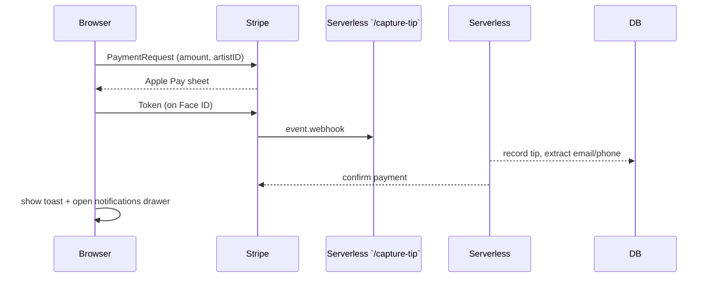

# Jovi sign-up ideas

> Conversation ID: 688ee8eb-ef6c-8321-9b4e-51547483b089
> Created: 2025-08-03T04:43:24Z
> Updated: 2025-08-03T17:34:14Z
> Messages: 14

---

## User

I'd like you to help me brainstorm some ideas about how we can make this a little more magic, the experience of signing up for Jovi. So, you sign in with, or you search for your artist from Spotify. And when you do that, we're then auto-populating that with an artist profile photo and an artist name and all that stuff. And then we have the listen button, and we're putting in an artist profile link for Spotify. It would be nice if we could magically pull in some other stuff. If there was a way that we could pull in, say, their Apple Music profile, or their SoundCloud profile, other music networks, if we could pull in their social handles and stuff automatically. Now, the source of truth for that would be Spotify pages, which I guess we could go and do, and scrape the Spotify page to see if we can get the URLs, because it's not available through the ABI. But I'm thinking, what else we could do? We could theoretically go to ChartMetric, which would give us the ability to quickly pull in all their social handles and stuff, and all of their music profile handles. Because it's hard, because artists don't have a unique identifier, right? Like, there's an ISRC number, but there's not really an artist number. I'm wondering if we can look at MusicBrainz or one of these other things. Of course, this works much better for established artists than for new artists, who will likely be the majority of the people using this. But I just want to brainstorm what things we could do to magically populate as much information as possible automatically, and make this experience really magical for our users.

---

## Assistant

Alright, Mr. White — if we want Jovi sign-up to feel “magic” and not just “fill out your profile,” we need to think in **layers of enrichment** so that the moment someone picks their Spotify artist name, it looks like we’ve already done 90% of the work for them.  

Here’s a brainstorm in escalating levels of “wow factor,” grouped by how we might implement:  

---

## **1. Core Auto-Fill from Spotify** (instant gratification)
- **Pull existing artist metadata** from the Spotify API:  
  - Name, profile photo, genres, popularity score.  
  - Top track preview for the “Listen” button.  
- **Background color / theme auto-match** from the profile photo for a branded feel (like Spotify Canvas visuals).  
- **Pull followers & monthly listener counts** for social proof.

---

## **2. Scraping & Cross-Linking Profiles**
- **Scrape public Spotify artist pages** (like you said) for outbound links in the “About” section.  
  - Many have links to Instagram, Twitter, Facebook, official websites.  
- **Use MusicBrainz API** to find matching artist records via name + Spotify ID:  
  - Returns a bunch of “relationships” including other music platform IDs, Wikipedia links, etc.  
- **Use Discogs API** for matching artist names + links to label pages, discography, and alternate spellings.  

---

## **3. Chartmetric / Viberate / Third-Party Aggregators**
- **Chartmetric API** (paid) → given a Spotify ID, instantly get:  
  - All social handles (Instagram, TikTok, YouTube, Twitter, Facebook).  
  - All music platform profiles (Apple Music, SoundCloud, Deezer, etc.).  
  - Engagement metrics, audience demographics (nice for dashboard upsells later).  
- **Viberate** works similarly but might be cheaper.

---

## **4. Social Handle Auto-Discovery**
For new artists without an aggregator record:
- **Search Google/Bing API** for `"Artist Name" site:instagram.com` and similar queries.  
- Use fuzzy matching to find likely official profiles.  
- Bonus: Ask them “Is this you?” so they can confirm or skip.  

---

## **5. Visual Magic**
- Auto-generate a **Jovi-styled hero banner** from their profile photo and colors.  
- If they have Spotify Canvas videos, **grab the frames** and animate them subtly on their profile page.  
- Auto-generate a matching **favicon + share preview image** so the link feels finished the second they sign up.

---

## **6. Smart Defaults**
- If no official links are found, suggest **placeholders** with inline edit:
  - “We didn’t find your Instagram — tap here to add it.”  
- Guess their Apple Music URL by slugifying their artist name and testing known Apple Music URL patterns.  
- Same for SoundCloud & YouTube Music.

---

## **7. Extra Magic for Established Artists**
- Pull their **Wikipedia intro** if available and drop it into the bio box.  
- Grab their **latest tour dates** from Songkick/Bandsintown API and offer a “Tour Dates” link block.  
- Auto-generate a “Listen Everywhere” section pulling all their DSPs at once.

---

## **8. Gamified Onboarding**
- After auto-filling, give them a “Jovi Magic Score” (how complete the profile is).  
- Show: “You’re 80% magic! Add your TikTok to get to 100%.”  
- Makes them feel like they’re finishing something rather than starting from scratch.

---

## **Implementation Priority**
1. **Spotify API** → Basic profile data.  
2. **Chartmetric/MusicBrainz** → Social/DSP links.  
3. **Scraping fallback** → Get missing links from Spotify “About” section.  
4. **Visual theming** → Hero banner + color extraction.  
5. **Smart guessing** → Apple/SoundCloud URLs from known patterns.

---

If you want, I can sketch out **a flow where a user searches their Spotify name, and within 1 second they see a fully-themed profile with 6+ pre-filled DSP/social links and a hero banner** — that’s the magic moment that will make them go “holy shit, this is already done for me.”  

Do you want me to put that **flow together visually** so we can map it to dev tasks?

---

## User

I'm also considering, um, would be, an idea is, um, on the actual profile, if there's like a, a little notification bell, and it says, um, something along the lines of like, you know, turn on notifications or something, and they turn them, and then they click it, and it opens up a drawer, with an input for your phone number, and then there's like a little toggle to switch to email, you can switch to email, and then they can either put in their phone number or their email, to get notified of, um, you know, when, when that artist puts out something new, and then like, that feature becomes like, global notifications, right, so they can notify people, you know, not just within any specific network, but meet them where they're at. Yeah. I'm just wondering if there's like a layout where we can have like... We want to keep the profile incredibly clean and like our whole dynamic is that... You know, we're... We're not allowing people to customize their profiles because we want them to convert. We want every time you hit a Joby profile for it to look identical. So that you clearly know where the call-to-action buttons are and stuff. And, you know, once you hit a profile, immediately there's the listen button to listen to music. And so I'm just trying to figure out... What's going to be the highest converting way to add... The ability to capture emails and phone numbers... Without... Um... You know, without... Messing up the profile conversion rates and stuff. And I'm thinking like it would be really cool as if there's a way that like... Let's say I go on like Deadmau5's Joby profile. And I type in my phone number and I click enter. And I'm now subscribed to notifications from Deadmau5. If I went to... Um... Say... Cascade's profile then. I should theoretically then be able to just turn on notifications. Without having to re-enter my phone number. You know what I mean? And like, that's a little confusing because... We're technically not having users sign up for accounts or anything. On Joby... Um... Well I guess... Theoretically that's something we could go to in the future. But probably not something you want to do earlier. But... I'm just like, what's the highest converting way you could do that? I guess you could like, cookie the user and then every time they return... We just auto fill out their phone number or something. Maybe we could display it as like... Kind of like grayed or blurred out or something. And make it clear that a phone number has already been entered. Or an email has already been entered. Like mask some of the phone number but show it already entered. Like show the last four digits or something. Um... I don't know. Help me explore that feature and really hone in on the details of it. And build it out in a way that it's going to make the platform feel magical. And get people the highest conversions possible.

---

## Assistant

Got it, Mr. White. Here’s a tight, conversion‑first design that keeps profiles uniform and “Listen” primary, while adding magical, one‑tap notifications.

---

## Product principles
- **Primary CTA stays “Listen.”** Notifications are secondary and quiet.
- **Progressive disclosure.** Nothing new appears until the user asks.
- **One‑tap after first verify.** The “magic” is zero friction on every artist after the first.

---

## UI pattern (minimal + consistent)
**Placement:** A bell icon (secondary style) on the right of the header, opposite the Listen button.  
**Behavior:** Click → bottom sheet/drawer.

**Drawer layout (simple)**
1. Title: **Get updates from {Artist}**
2. Tabs: **Text** | **Email** (Text default)
3. Input:  
   - **Phone** with country picker; masked as `(***) ***‑1234` after capture  
   - **Email** masked as `t***@g***.com` after capture  
4. Microcopy (1 line): “You’ll use this for any artist on Jovie. Reply STOP to unsubscribe.”  
5. CTA: **Turn on notifications** (disabled until valid input)  
6. Legal subtext (8pt): “By subscribing, you agree to receive automated updates. Msg/data rates may apply. STOP to opt out. Terms • Privacy”

---

## First‑time flow (friction where needed)
1. User opens bell → chooses Text (default) or Email → enters contact.  
2. **Verify:**  
   - SMS: 6‑digit OTP; Email: one‑click magic link (or code).  
3. On success:  
   - Toast: “You’ll get updates from {Artist}. You can manage this anytime.”  
   - Drawer shows **Subscribed** state with a per‑artist toggle.

**Copy options (test)**
- “Be first when new music drops.”  
- “Text me when {Artist} releases.”  
- “Get drop alerts.”

---

## Returning flow (the magic)
- Store a **pseudonymous token** in `localStorage` (e.g., `jovie_contact_token`), issued after verify.  
- On any artist profile:  
  - Bell shows **Following** if subscribed; otherwise shows **“Turn on (••••1234)”** one‑tap CTA.  
  - Drawer opens showing masked contact pre‑filled + big **Turn on** button (no re‑entry).  
- If `localStorage` absent (new device): fall back to input + verify.

---

## Global vs per‑artist logic
- **Per‑artist toggle** in the drawer.  
- **Manage all** link (tiny) opens a lightweight preference panel:  
  - Contact: phone/email (masked)  
  - Toggles for categories (New release, Video, Tour, Merch)  
  - Global opt‑out  
- Keep this panel off-profile (route: `/manage`) to avoid clutter.

---

## Data model (lean)
- **ContactMethod**: `{ type: 'sms'|'email', value_hash, verified_at }`
- **VisitorToken** (server‑issued, stored in localStorage): ties browser to ContactMethod.
- **Subscription**: `{ artist_id, contact_id, channel, categories[], created_at, status }`

Security: hash contact at rest; encrypt PII; never render full contact—only last 2–4 digits/chars.

---

## Delivery + compliance (non‑negotiable)
- **Double opt‑in** (OTP/magic link).  
- **TCPA/CAN‑SPAM/GDPR**: clear consent text; age gate if needed; STOP/UNSUB works; audit log of consent.  
- Quiet hours, send caps, time‑zone aware scheduling.  
- Providers: Twilio (SMS), Postmark/Mailgun (email).

---

## Conversion guardrails
- Bell is **outline/mono**; smaller than Listen; no animation until success.  
- No banners or interstitials.  
- Post‑subscribe success = tiny confetti burst in drawer only (not page‑blocking).  
- Default category = **New releases only** (lowest annoyance). Upsell others later.

---

## Edge cases
- **Multiple artists at once:** After first verify, show a **sticky one‑tap** in the drawer (“Follow {Artist} with ••••1234”).  
- **Number already used:** Show “Looks like you’re set up. Turn on?” with one‑tap.  
- **Incognito / blocked storage:** degrade to re‑entry + verify; suggest “Remember me on this device” checkbox that simply re‑tries setting token.

---

## Lightweight instrumentation
- Track: bell_opened → method_selected → input_valid → verify_sent → verify_success → subscribed.  
- Attribute any uplift/dip in **Listen CTR** after adding bell (guardrail).

---

## A/B tests (sequential)
1. **Bell label**: icon‑only vs “Notify” label on md+ screens.  
2. **Default channel**: SMS vs Email.  
3. **Microcopy**: “Be first” vs “Drop alerts.”  
4. **Drawer vs modal**: (expect drawer to win for mobile).  
5. **One‑tap phrasing**: “Turn on (••••1234)” vs “Follow with your saved number.”

---

## Implementation steps (1‑week sprint outline)
1. Bell + drawer UI (tabs, input, masks, legal).  
2. OTP/magic‑link verify endpoints; token minting; localStorage bootstrap.  
3. Subscriptions API (create/toggle) + per‑artist state on load.  
4. Preference center (MVP) + STOP/UNSUB plumbing.  
5. Analytics events + A/B flags.  
6. Copy + legal review.

---

If you want, I’ll spec the exact API contracts and the drawer component props next (plus the masked‑contact states and microcopy variants) so engineering can build without ambiguity.

---

## User

Compose a MarkDoc document for me that I'm going to place in the repo for future features. Describe this in detail so that in that folder I will place this whole description and I want it outlined the way you see it. Once you've done it, I'll just place that in there and then we can give that MarkDoc document to AI later to have it start building out this feature. There we go. There we go.

---

## Assistant

Got it, Mr. White — here’s the **MarkDoc** version for your repo’s `future-features/` folder.  
This is structured for clarity so that when you or an AI dev picks it up later, it’s implementation-ready.  

---

```markdown
# Jovi Feature Spec: Universal Artist Notifications

## Summary
This feature allows visitors to any Jovi artist profile to subscribe for notifications (SMS or Email) when that artist releases new content. After a one-time verification, visitors can follow multiple artists without re-entering their contact details. The system should feel “magical,” frictionless, and fully consistent with Jovi’s clean, conversion-focused design.

---

## Goals
- Enable visitors to opt-in to artist notifications directly from an artist’s Jovi profile.
- Keep profiles visually consistent and conversion-optimized (primary CTA remains **Listen**).
- Provide a “one-tap” subscribe experience after first verification.
- Support both SMS and Email delivery channels.
- Store minimal, secure user data; comply with all relevant laws (TCPA, CAN-SPAM, GDPR).
- Create a global subscription system tied to a pseudonymous browser token, not a full user account.

---

## UI/UX Overview

### Entry Point
- **Bell icon** on profile header (secondary CTA, outline style).
- Icon sits opposite the Listen button.
- Clicking the bell opens a **bottom sheet / drawer**.

### Drawer Layout
1. **Title:** `Get updates from {Artist}`
2. **Tabs:** `Text` | `Email` (default: Text)
3. **Input Field:**
   - Phone: country picker + phone field
   - Email: email field
   - After capture, display masked: `(***) ***-1234` or `t***@g***.com`
4. **Microcopy:** “You’ll use this for any artist on Jovi. Reply STOP to unsubscribe.”
5. **CTA:** `Turn on notifications` (disabled until valid input)
6. **Legal Subtext:** “By subscribing, you agree to receive automated updates. Msg/data rates may apply. STOP to opt out. Terms • Privacy”

---

## User Flows

### First-Time Subscription
1. User clicks bell → Drawer opens.
2. Chooses Text or Email → enters contact info.
3. **Verification:**
   - SMS: 6-digit OTP
   - Email: magic link or code
4. On success:
   - Toast: “You’ll get updates from {Artist}.”
   - Drawer now shows subscribed state + per-artist toggle.

### Returning Visitor
- A pseudonymous token (`visitor_token`) stored in `localStorage` links the browser to their verified contact.
- On any artist profile:
  - Bell shows “Following” if subscribed.
  - Drawer pre-fills masked contact with **Turn on notifications** one-tap option.
- If `localStorage` is missing (new device), revert to first-time flow.

---

## Data Model

### ContactMethod
```json
{
  "id": "uuid",
  "type": "sms" | "email",
  "value_hash": "sha256(contact)",
  "verified_at": "timestamp"
}
```

### VisitorToken
```json
{
  "id": "uuid",
  "contact_id": "uuid",
  "token": "secure_random_string",
  "created_at": "timestamp"
}
```

### Subscription
```json
{
  "id": "uuid",
  "artist_id": "string|spotify_id",
  "contact_id": "uuid",
  "channel": "sms" | "email",
  "categories": ["new_release"],
  "status": "active" | "inactive",
  "created_at": "timestamp"
}
```

---

## Global Preferences Panel
- Accessible via a small “Manage all” link in drawer.
- Shows:
  - Masked contact info
  - Toggles per category: New releases, Video drops, Tour dates, Merch
  - Global opt-out option
- Hosted off-profile (`/manage`) to avoid clutter.

---

## Compliance & Legal
- Double opt-in required (OTP or magic link).
- TCPA compliance: explicit consent, opt-out instructions.
- CAN-SPAM for email: unsubscribe link in every message.
- GDPR: allow data deletion requests.
- Maintain consent logs.

---

## Messaging Infrastructure
- **SMS Provider:** Twilio (or equivalent)
- **Email Provider:** Postmark or Mailgun
- Timezone-aware scheduling & quiet hours.
- Send caps to avoid spam complaints.

---

## Conversion Safeguards
- Bell icon smaller and lighter than Listen button.
- No disruptive banners/interstitials.
- Confetti burst or subtle animation only on success.
- Default subscription category: New releases only (low annoyance).

---

## Analytics
Track:
- `bell_opened`
- `method_selected`
- `input_valid`
- `verify_sent`
- `verify_success`
- `subscribed`
- Drop-off points

---

## A/B Testing Ideas
1. Icon-only bell vs bell + “Notify” label.
2. SMS vs Email as default.
3. Microcopy variations (“Be first” vs “Drop alerts”).
4. Drawer vs modal presentation.
5. One-tap phrasing tests.

---

## Implementation Steps
1. Bell + drawer UI component.
2. OTP/magic link verification endpoints.
3. Visitor token minting + localStorage bootstrap.
4. Subscription API (create/toggle) + per-artist state handling.
5. Global preferences page.
6. STOP/UNSUB command handling.
7. Analytics integration.
8. Legal review.

---

## Edge Cases
- Multiple artist subscriptions in one session.
- Number/email already in use (show “Looks like you’re set up” flow).
- Incognito mode or blocked localStorage (force re-entry + verify).
- Device switching: subscription works but requires one-tap verification again.

---

## Dependencies
- Notification delivery service (Twilio/Postmark/Mailgun)
- Secure token service
- Spotify Artist IDs as canonical `artist_id`
- LocalStorage for visitor token persistence

---

## Future Enhancements
- Account-based persistence (optional, later phase)
- Category-specific alerts per artist
- Cross-device subscription sync
- Push notifications (PWA or native app)

---
```

---

If you want, I can also prep you a **`/future-features/universal-artist-notifications.md`** filename with this already in repo-friendly formatting so you can just drop it in.  
Want me to do that next?

---

## User

That's great. So now you kind of get the idea of where we're trying to go with this product, and how we're trying to, like, basically be a new generation of Link and Bio products that actually, like, really serves a purpose in helping artists out and helping them grow a fanbase and make more money, whereas a lot of the Link and Bio products just seem to be clones of LinkTree, which, like, is really kind of a crappy product if you think about it. Everyone's LinkTree looks completely different, and you can even put your Instagram link in, like, one of ten different places, so every time you hit a LinkTree, it's completely different, and they're not efficient, and every link can have a different design, the whole page can have a different design, like, within a single LinkTree, you can have five different designs for links. There's, you know, scrolling like crazy, there's, you know, glittery backgrounds, it feels like MySpace, it just doesn't convert, whereas, you know, we're trying to build something that's more like Facebook, where it's like every Facebook profile, you hit profile images in the same place, the, you know, links are in the same place. Like, it makes users familiar with it, and they understand how to use it, and therefore it converts, so that's really what we're trying to do, and I think this is a huge one, you know, Lelo is a big competitor that, you know, I'm friends with Alec who built the product, and the design of the actual landing pages has not changed since day one. They're still pretty ugly, and it's kind of shocking that they haven't spent a single minute of their time on actually improving the design of the landing pages that everyone goes to, to increase conversion rates, so I really, I really want to do things like this to become that differentiator, because, you know, at the end of the day, if I can't make a link, I'm not going to make a link. If I can make artists more money by using this product, I can justify the cost of the product, and that's kind of where we're going. I don't want to add features just to add features, I think that's what a lot of people do, and, you know, it's not really useful. Having, you know, yeah, so what I would like to do now is kind of brainstorm what are other kind of next level, next generation features we could build out like this that really would set us apart and really justify paying for this product.

---

## Assistant

**Next-Gen Jovi Features — High-Impact Ideas That Print Money for Artists**

| # | Feature | Why It Prints Money / Grows Fans | Implementation Sketch (lean MVP) | Differentiator vs. “LinkTree clones” |
|---|---------|---------------------------------|-----------------------------------|--------------------------------------|
| 1 | **Smart Merch Drop Block** | One-click buy inside the profile (fewer hops = higher AOV). Limited-edition countdown drives urgency. | Shopify + Printful webhook → auto-inject “Drop” CTA when inventory > 0. Real-time inventory badge (“12 left”). | LinkTree can only point *away*; Jovi converts **in-place**. |
| 2 | **Dynamic Pre-Save / Pre-Order Aggregator** | Locks in streams before release; boosts day-one charting. | Poll DSP APIs (Spotify, Apple, Deezer) daily. If artist has an unreleased UPC, auto-render “Pre-Save everywhere” banner with one tap. | Fully automatic; no manual setup. |
| 3 | **Geo-Aware Tour Alert** | Sells tickets to the *right* fans, not random global push. | On profile load, IP → city. If artist has Songkick/Bandsintown date within 150 km, surface “See you in {City} – Tickets” ribbon. | Real-time, location-aware. |
| 4 | **Tip-Jar / Micro-Patron** | Direct artist revenue when no merch is ready. Fans love $2 “buy a coffee.” | Stripe Link + Apple Pay; single amount or quick presets ($2, $5, $10). | Frictionless; no Patreon account needed. |
| 5 | **Fan CRM Lite (“Top 1% Club”)** | Turns casuals into whales via exclusives. | After notification opt-in, auto-tag heavy link clickers & streamers; allow artist to send VIP drops only to that segment. | True segmentation, not spray-and-pray blasts. |
| 6 | **Source-Aware Personalization** | Higher CTR because CTA text matches funnel. | Read `utm_source`. From TikTok → “Open in TikTok Music.” From Twitter/X → “Tweet this track & unlock demo.” | Makes each channel feel native without manual link duplication. |
| 7 | **Split-Test Engine** | Continuous conversion lift = more streams/sales. | Auto-rotate two CTA copies and pick winner after 1 k visits. Simple dashboard: uplift % and auto-promote winner. | LinkTree doesn’t optimize; Jovi self-tunes. |
| 8 | **“Quest to Unlock” Fan Tasks** | Viral reach; fans push instead of artist. | Puzzle UI: Stream song → Share on IG story → Unlock unreleased demo/Lyric PDF. Verify share via IG oEmbed. | Reduces paid ads; builds organic flywheel. |
| 9 | **Real-Time Social Proof Chips** | Boosts FOMO, raises follow clicks. | WebSocket feed from Spotify listeners count; display “1 925 listening now” chip near Listen button. | Live numbers feel legit; LinkTree is static. |
|10 | **Auto-Generated Press Kit Tab** | Saves artists a day of grunt work. | Pull hi-res image + 150-word bio + logo PNG → downloadable ZIP. | Another upsell target; zero effort for artist. |
|11 | **Collab Link (“Voltron Mode”)** | Combines audiences of collab tracks. | Accept multiple Spotify IDs → fans pick which artist to follow; unified merch bundle. | No existing link-in-bio nails multi-artist journeys. |
|12 | **Sponsor Slot Marketplace** | Artists monetize profile real estate when not touring. | Simple ad slot; Jovi sells to brands, rev-shares with artist. | Passive income; still keeps layout uniform. |
|13 | **AI Curated Highlights Reel** | Keeps fans on page longer, ups playlist adds. | Summon 30-sec clips of top songs + TikTok UGC via OpenAI + FFmpeg worker. | Automatically fresh; no manual curation. |
|14 | **Collectible Drops (ERC-6551 “Backstage Pass”)** | High-margin digital merch; loyalty loop. | One-tap purchase via Stripe → custodial wallet; perks auto-granted in CRM. | Web3 without the wallet headaches. |
|15 | **PWA Push Notifications** | Own the channel; no platform tax. | Installable PWA served from Jovi. Opt-in push for releases, shows, merch. | Bypasses email open-rate decline. |

### Quick Prioritization (Effort × Impact)

1. **Dynamic Pre-Save** — low dev, huge day-one stream lift.  
2. **Smart Merch Drop** — direct $$, minimal extra UI.  
3. **Geo Tour Alert** — leverages existing Songkick API, instant ticket bump.  
4. **Split-Test Engine** — platform-wide conversion gains pay compounding dividends.  

If you want a MarkDoc spec for any of these next, tell me which one and I’ll draft it.

---

## User

So, one thing I like the idea of is using URLs to add more features without taking away from the design. So, like we're talking about the tip feature here, the tip jar, and I love the quick presets $2, $5, $10. What I think would be really cool is if it was a... So, let's say your profile is jov.ie slash pink, right? That's pink's music profile. Well, what if jov.ie slash pink slash tip opened up the same profile, but instead of the listen button, it had three buttons, $2, $5, $10. And you clicked $5, and it opened up a little Apple Pay thing without leaving the page ideally. It opened up the little Apple Pay drawer, you authorized your Apple Pay, and then boom. And I'm thinking that this is like someone's opening it on an iPhone on mobile. You click $5, boom, Apple Pay comes up with a $5 on it. Face ID, you pay, the drawer goes away, and it says, you know, thanks for the tip. And then maybe now it prompts you to turn on notifications or something, right? Or like, I don't know if through the Apple Pay transaction we can get their email or their phone number to make the turn on notifications even more seamless. But maybe now there's a flow where, okay, we got a tip from them, let's also get their email or their phone number. And then, boom, hey, do you want to check out my music on Spotify? And then boom, we can send them, we flip over to the listen button. And so, you know, basically we're like taking this profile and kind of like dynamically adjusting it based on the action that you're doing. You know, maybe it's a pink slash tour and it shows their tour dates. And then, you know, when they tap the notifications or whatever, you know, from there. You know, that way, you know, if I'm an artist, I could be busking on the street and I could have a QR code on a sign or something that's the slash tip URL. But, you know, if I'm just posting stickers around, it's going to go just to my slash listen URL or just to my base URL because I'm trying to drive people to my music. You know what I mean? So that's one thing on the tip feature. I do like the geoware tour alert. Where if someone has a tour date coming up in the location where the person is, we would show a banner. That's like, you know, get tickets to see Pink at Crypto Arena, but that only shows if you're based in LA. Or it says get tickets to see Pink at Madison Square Garden, but that only shows if you're in New York. But then also, if Pink isn't playing in the future in your city, it doesn't show anything. I do really like that. Kind of, you know, avoids the thing of like people just going to tour pages that say I'm not touring, you know what I mean? I definitely want to do the number five, the CRM thing. We'll definitely do something with that. I like that feature. I do like number seven, the split test engine. I'm not really a fan of eight yet. I feel like that's losing focus. Number nine, again, I think losing focus. I do like ten, but I think that's losing focus. I think that that's a later feature. Twelve feels like a waste. Okay. Not crazy about fourteen. Fifteen is interesting. I'd like to explore that more. I think those are the ones that make the most sense to me as high priority ones. And also generally feel like they'd be the lowest lift to build. I also think that they're all great selling points that really hone in on the target audience. Could you kind of expand on those and help me out with that?

---

## Assistant

### High-Priority, Low-Lift “Magic” Features — Deep Dive

---

## 1. URL-Based **Tip Jar** (`/artist/tip`)
**Goal:** turn casual visitors into instant revenue without cluttering the default profile.

| Aspect | Detail |
|---|---|
| **Route pattern** | `/:handle` → normal Listen CTA • `/:handle/tip` → Tip-mode layout |
| **UI Swap** | Replace Listen with three buttons: `$2 Tip`, `$5 Tip`, `$10 Tip` (Stacked, large, Apple-Pay-enabled). |
| **Payment flow** | <br>1. Button → `PaymentRequest` API<br>2. Restrict to Apple Pay + Google Pay for one-tap UX<br>3. Request “name” & “email/phone” fields (Apple Pay can return both)<br>4. On success: show toast “Thanks for the tip 🎉” → slide CTA row back to **Listen** & surface **“Turn on notifications”** drawer pre-filled with the captured email/phone. |
| **Tech** | Stripe Checkout **in “Payment Element” mode** inside the page, or use Stripe’s native Apple Pay sheet with client-side PaymentRequest → serverless “capture-tip” endpoint.<br>Preserve route via shallow Next.js routing so the sheet overlays current page. |
| **Edge cases** | Desktop fallback: show QR for mobile Apple Pay; optional card field behind `expand` toggle. |
| **Analytics** | `tip_opened`, `amount_selected`, `payment_success`, post-tip notification_opt_in. |
| **Busker QR** | Generate QR in dashboard pre-formatted to `…/tip` so street fans skip extra taps. |

---

## 2. **Geo-Aware Tour Alert** Banner
**Goal:** surface the *next* local show only when relevant → higher ticket conversions.

| Aspect | Detail |
|---|---|
| **Trigger logic** | On page load:<br>1. IP → city/lat-lon (Cloudflare Geo header)<br>2. Query Songkick/Bandsintown for artist dates within `radius ≤150 km` & `date ≥ today`.<br>3. If match → inject banner; else nothing rendered. |
| **Banner UI** | Compact strip above header, dark theme:<br>“🎟 Pink • Crypto.com Arena • Oct 14 → Get Tickets” (button). |
| **URL override** | `/:handle/tour` route shows **full tour list** (map + dates) even if no local date. |
| **Ticket link** | Prefer primary ticketer deep link; else Ticketmaster affiliate (extra rev-share line). |
| **Caching** | Cache tour JSON per artist daily; Geo check stays edge-side (fast). |
| **Analytics** | impressions vs. clicks → measure incremental ticket sales. |

---

## 3. **Fan CRM Lite** (“Top 1% Club”)
**Goal:** capture, segment, and re-engage high-value fans without full marketing-cloud bloat.

| Aspect | Detail |
|---|---|
| **Data captured** | • Email/SMS from notifications or Apple Pay tips<br>• Click + Listen events (per visit)<br>• Tip history |
| **Scoring** | Simple heuristic:<br>• `+5` for tip, `+2` for notification opt-in, `+1` per link click past first.<br>`score ≥10` → tag as **Superfan**. |
| **Artist dashboard** | Table: contact info masked • score • last action • “Send DM” button (SMS/email broadcast to segment). |
| **Comms** | Template messages (“Early access to the new single!”). Send-caps & opt-outs handled by the same notification service. |
| **Privacy** | Hash phone/email as key; decrypt on-send only. Fans see “Powered by Jovi — unsubscribe” footer. |

---

## 4. **Split-Test Engine**
**Goal:** auto-optimize conversion copy without artists lifting a finger.

| Aspect | Detail |
|---|---|
| **What to test first** | • Listen button copy (“Listen” vs “Play Now”)<br>• Banner color (brand-accent vs. neutral)<br>• Notification prompt copy (“Be first” vs “Drop alerts”). |
| **MVP approach** | 1-line experiment flag in DB: `{ test_id, variant_a, variant_b, weight }`.<br>Visitor token assigns variant on first load; persisted in localStorage. |
| **Metrics** | Primary: Listen button click-through rate.<br>Secondary: downstream plays (Spotify redirect param). |
| **Autopromotion** | After `n ≥ 1 k` visits & ≥95 % conf., auto-set winning variant as default. |
| **UI for artist** | Only show uplift % and “current winner.” No knobs → stays idiot-proof. |

---

## 5. **PWA Push Notifications** (“Own the Channel”)
**Goal:** bypass email noise; send release pings straight to locked phone screens.

| Aspect | Detail |
|---|---|
| **Install prompt** | Show “Add Jovi to Home Screen for instant alerts” banner **only** after user has opted for any notifications (SMS/email) → social proof. |
| **Tech** | Next.js PWA plugin + VAPID keys → Web Push API.<br>Service Worker caches profile shell for offline; push payload triggers custom notification. |
| **Payload types** | • New release<br>• Local tour alert<br>• Merch drop. |
| **Fallback** | iOS <16.4 used to block web push; if unsupported, hide feature and rely on SMS/email. |
| **Legal** | Prompt must include “You can turn this off anytime” link to `/manage`. |

---

### Build-Order Recommendation
1. **Tip Jar route** (`/tip`) — direct revenue, easy Stripe-only backend.  
2. **Geo-Tour Banner** — simple API + edge logic, immediate ticket ROI.  
3. **Fan CRM Lite** — leverages 1 & 2 data; unlocks future monetization.  
4. **Split-Test Engine** — multiplies conversion gains across whole platform.  
5. **PWA Push** — nice-to-have once core channels humming.

Let me know which one you want formalized into a MarkDoc spec next, and I’ll draft it.

---

## User

Yeah, this is great, let's um, let's do the tip jar route. Formalize that into a MarkDoc.

---

## Assistant

```markdown
# Jovi Feature Spec: Tip Jar Route (`/:handle/tip`)

## Summary
A specialised URL (`/<artist>/tip`) that swaps the default **Listen** CTA for three one-tap tip buttons ($2, $5, $10). Payments fire Apple Pay/Google Pay in-page, thank the fan, and then invite them to turn on notifications with their newly captured contact info.

---

## Goals
- Monetise spontaneous goodwill (busking QR, live-stream overlays, social links).
- Keep the primary profile (`/<artist>`) visually unchanged and conversion-optimised.
- Zero-friction mobile flow: tap → Face ID → done → opt-in prompt.
- Collect verified email/phone to seed Fan CRM Lite.

---

## Route & URL Pattern
| Route | Mode | CTA Row |
|-------|------|---------|
| `/:handle` | Default | **Listen** button |
| `/:handle/tip` | Tip Mode | `$2 Tip` · `$5 Tip` · `$10 Tip` buttons |

Shallow route via Next.js (`router.push('/[handle]/tip', undefined, { shallow:true })`) keeps the same page shell and SEO.

---

## UI / UX
1. **CTA Swap** – Three stacked buttons (large, brand-accent).  
2. Tap a button → trigger **PaymentRequest API**.  
3. Apple Pay / Google Pay sheet shows amount + artist name.  
4. On success:  
   - Toast: “Thanks for the $5 tip 🎉” (sub-second).  
   - CTA row fades back to **Listen**.  
   - Auto-open **Turn on notifications** drawer with phone/email pre-filled from payment payload.  
5. If user cancels → no state change, stay on tip mode.

Desktop fallback: show QR code to the same `/tip` URL plus an instruction (“Scan to tip via Apple Pay”).

---

## Payment Flow (Stripe)


- **Products:** three Stripe Prices ($2, $5, $10) per currency.  
- **Metadata:** `{ artist_id, amount }`.  
- **Webhook** stores `contact_info`, issues `tip_success` event.

---

## Data Model Additions
```json
{
  "Tip": {
    "id": "uuid",
    "artist_id": "spotify_id",
    "contact_id": "uuid (nullable)",
    "amount_cents": 500,
    "currency": "USD",
    "payment_intent": "pi_...",
    "created_at": "timestamp"
  }
}
```
If the Apple Pay payload includes email/phone, attempt to match & link to existing **ContactMethod**; otherwise create new on first notification opt-in.

---

## Security & Compliance
- Stripe handles PCI; server receives only tokenised card info.
- Store amount and masked contact only.
- Add “Tips are non-refundable” text below buttons (8 pt).
- Same TCPA/CAN-SPAM obligations apply when re-using contact for notifications.

---

## Analytics
Event               | Notes
------------------- | ---------------------------
`tip_opened`        | `/tip` page view  
`tip_amount_click`  | value chosen  
`tip_payment_success` | includes amount  
`notif_drawer_auto_open` | after successful tip  
`notif_opt_in_post_tip` | conversion metric  

---

## Edge Cases
1. **Unsupported PaymentRequest** – fallback to Stripe Checkout redirect.  
2. **Payment fail** – show inline error, no CTA swap.  
3. **Incognito / blocked storage** – notifications drawer shows empty fields; user can still opt-in manually.  

---

## Implementation Steps (Sprint ≃ 1 week)
1. Add shallow `/tip` route & CTA swap component.  
2. Integrate Stripe PaymentRequest (+ fallback).  
3. Webhook → Tip table insert → contact capture.  
4. Auto-open notification drawer with pre-filled mask.  
5. Generate QR creator in artist dashboard.  
6. Unit test: mobile Safari, Chrome Android, desktop fallback.  
7. Instrument analytics.  
8. Legal text & privacy-policy update.

---

## Future Enhancements
- Custom amounts for superfans (dropdown “Other”).  
- Dynamic amounts based on follower milestones (e.g., $7 for 7 M streams).  
- Display running total (“Fans have tipped $3 421 to Pink”) for social proof.  
- Optional “Tip + Message” that sends note to artist inbox.
```

---

## User

Another feature would be when you're viewing on a desktop, it would just pop up a little QR code in the bottom right corner of the screen that says View on Mobile. And it's just an auto-generated QR code that links them to that profile.

---

## Assistant

```markdown
# Jovi Feature Spec: “View on Mobile” Desktop QR Overlay

## Summary
When a visitor loads any Jovi profile on a non-mobile viewport (≥ 768 px width), display a small, dismissible QR overlay in the bottom-right corner. Scanning the QR opens the same profile URL on mobile, encouraging friction-free actions like Apple-Pay tipping or deep-link listening.

---

## Goals
- Nudge desktop users toward the richer mobile experience (tip jar, Apple Pay, native streaming apps).
- Keep the overlay unobtrusive, brand-consistent, and dismissible.
- Track scans vs. dismissals for optimisation.
- Zero artist configuration—generated automatically for every profile route (`/:handle`, `/:handle/tip`, `/:handle/tour`, etc.).

---

## UI / UX

| Element | Spec |
|---------|------|
| **Position** | Bottom-right, `16 px` from edges; z-index above page content. |
| **Size** | `120 × 120 px` QR + 16 px padding container; shrinks to 96 px on narrow desktops. |
| **Copy** | Caption under QR: “View on mobile” (12 pt, mono-color). |
| **Dismiss** | `×` icon top-right of the container; fade-out animation (200 ms). |
| **Reopen** | Small “phone” icon sticky in same corner after dismiss; click restores QR. |
| **Entrances** | Fade-in after 1.5 s page idle or on scroll > 50 vh. |

---

## Technical Details

1. **Viewport Detection**  
   ```js
   const isDesktop = window.matchMedia('(min-width: 768px)').matches;
   ```
2. **QR Generation**  
   - Use lightweight library (`qrcode-styled-encoder` or `qrcode.react` dynamic import).  
   - Encode `window.location.href` + `?src=qr_desktop` UTM param.  

3. **Lazy Load**  
   - Import QR lib only after confirming desktop to keep mobile bundle lean.  

4. **State Management**  
   - `localStorage('jovie_hide_qr')` → hide for 7 days after user dismisses.  

5. **Accessibility**  
   - `aria-label="Scan to view on mobile"` on QR `<canvas>` / `` element.  

6. **Styling**  
   - Rounded 8 px corners, subtle shadow (`rgba(0,0,0,.15)`), backdrop-blur for glassy look.  
   - Matches existing Jovi secondary color scheme.

---

## Analytics

Event                         | Payload
----------------------------- | ---------------------------------
`desktop_qr_shown`            | `{ profile: handle }`
`desktop_qr_dismissed`        | `{ profile: handle, seconds_visible }`
`desktop_qr_scan_redirected`* | `{ profile: handle, route: pathname }`

\*Measured via UTM param hit on mobile load (`src=qr_desktop`).

---

## Edge Cases
- **Mobile browsers with desktop UA**: overlay suppressed if `touchstart` fires before 1 s.  
- **Low-powered devices**: if `requestIdleCallback` not supported, fall back to `setTimeout`.  
- **SEO crawlers / screenshots**: overlay hidden when `prefers-reduced-motion` or `print` media query active.

---

## Implementation Steps
1. Create `<DesktopQrOverlay/>` component with lazy QR import.  
2. Add to `ProfileLayout` with viewport check.  
3. Write dismissal & localStorage logic.  
4. Add UTM param helper and scan redirect tracking.  
5. Unit-test viewport switches, dismiss persistence, and QR accuracy.  
6. Ship behind feature flag `next.desktopQr`.  
7. Monitor analytics → adjust idle timing / size based on scan rate.

---

## Future Enhancements
- Auto-detect macOS Safari + iPhone handoff: prompt “Open on your iPhone?” via `navigator.share`.  
- Contextual QR colours matching artist palette.  
- A/B test different corner positions and copy (“Scan to tip quickly!”).

---
