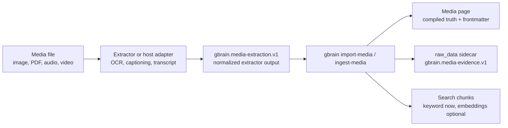

# Media Evidence Import

GBrain can import normalized media evidence as searchable brain pages. This is the text-backed foundation for image, PDF, audio, and video support: an extractor produces JSON, then GBrain stores the normalized evidence and indexes its caption/OCR/transcript text.

This does not perform binary image or video understanding by itself. Use an OCR, transcript, multimodal, or host adapter to produce `gbrain.media-extraction.v1` JSON first.



In plain English: the extractor tells GBrain what the media contains. GBrain
then gives that media a normal brain page, keeps the structured evidence in
`raw_data`, and makes the useful text searchable.

## Schemas

Extractor output uses `gbrain.media-extraction.v1`:

```json
{
  "kind": "image",
  "sourceRef": "screenshots/error.png",
  "title": "Stripe login error screenshot",
  "ocrText": "Stripe API key invalid.",
  "tags": ["stripe", "error"],
  "segments": [
    {
      "id": "image-root",
      "kind": "asset",
      "caption": "Dashboard screenshot with error banner",
      "ocrText": "Stripe API key invalid."
    }
  ]
}
```

GBrain normalizes that into `gbrain.media-evidence.v1`, stores it in `raw_data`, and chunks the searchable text alongside the media page.

## CLI

Import precomputed extraction JSON:

```bash
gbrain import-media \
  --slug media/evidence/stripe-login \
  --extraction stripe-login.extraction.json \
  --media-file screenshots/stripe-login.png \
  --no-embed
```

Use `ingest-media` when you want the media file to define the default slug and source reference:

```bash
gbrain ingest-media screenshots/stripe-login.png \
  --extract stripe-login.extraction.json \
  --no-embed
```

`--no-embed` still indexes keyword-searchable chunks. Run `gbrain embed <slug>` later if you want vector embeddings for the imported page.

## Boundaries

- Core GBrain accepts normalized evidence JSON and makes it searchable.
- Provider or host adapters are responsible for OCR, captions, transcripts, and multimodal extraction.
- Full binary image/video understanding and multimodal embeddings are follow-up layers, not requirements for this importer.
